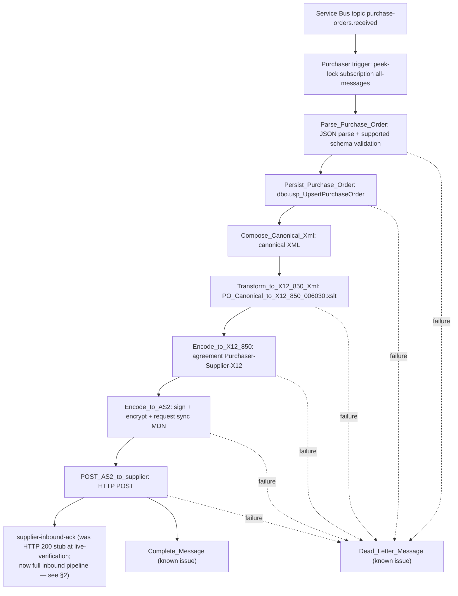
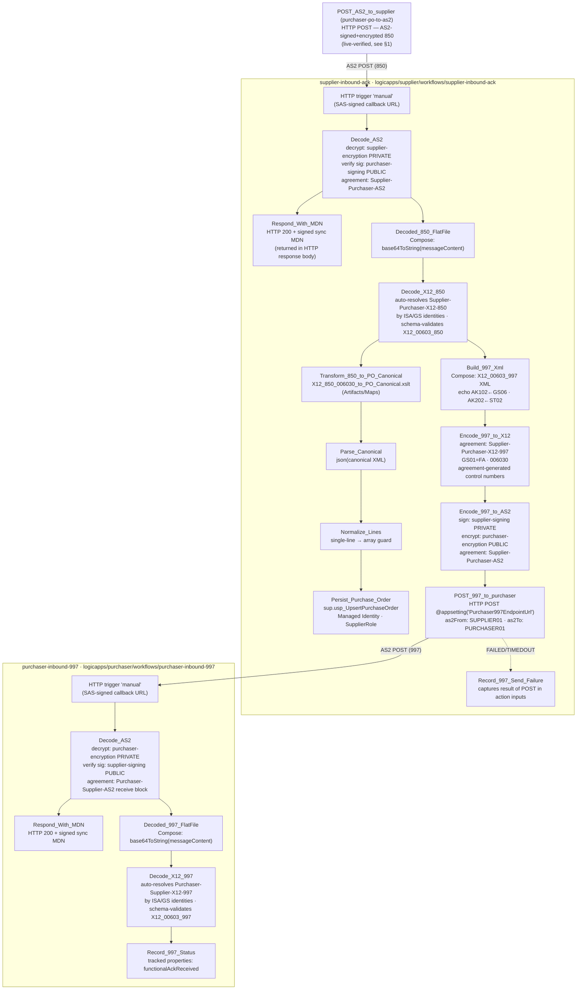

# End-to-End EDI Flow — Purchaser PO, Supplier 850 Receive, and 997 Return

> **Status — purchaser send path (2026-07-20T14:35:00-05:00):** Verified live through supplier HTTP 200. Service Bus settlement remains open.
> **Status — supplier receive + 997 return path (2026-07-21):** AUTHORED on branch `feature/supplier-inbound-997-workflow`; not yet deployed or live-verified. Workflow `.json` files, Bicep, SQL DDL, and the XSLT map are committed on this branch but no live round-trip has been executed. See §2 and the authoritative design at [`docs/supplier-workflow-epic-design.md`](supplier-workflow-epic-design.md).

## 1. Purchaser send path (live-verified)

### Action-by-action notes — purchaser send

| Step | Runtime detail |
|---|---|
| Input | `samples/purchase-order-e2e-test.json` or another non-sensitive canonical PO JSON is published to Service Bus topic `purchase-orders.received`. |
| Parse | `Parse_Purchase_Order` uses Logic Apps Parse JSON. Regex `pattern` is unsupported, so currency/state/country validation is currently length-only. |
| Persist | Purchaser SQL connection uses managed identity with concrete SQL connection values in `logicapps/purchaser/connections.json`; `dbo.usp_UpsertPurchaseOrder` is idempotent on `PoNumber`. |
| Canonical XML | `Compose_Canonical_Xml` emits the XML consumed by the map; downstream XSLT reads it with `outputs('Compose_Canonical_Xml')`. |
| Transform | `PO_Canonical_to_X12_850_006030.xslt` produces XML rooted at `X12_00603_850` in namespace `http://schemas.microsoft.com/BizTalk/EDI/X12/2006`. |
| X12 encode | Uses Integration Account agreement `Purchaser-Supplier-X12`. The send-side schema reference intentionally omits `senderApplicationId`; the envelope still uses `senderApplicationId = PURCHASER01`. |
| AS2 encode | Standard built-in AS2 v2 returns `messageContent.$content` and `messageHeaders`. The HTTP body decodes `$content` with `base64ToBinary(...)`. |
| Supplier POST | `POST_AS2_to_supplier` reads the clean app setting `SupplierAs2EndpointUrl` and posts to the supplier callback URL stored in Key Vault. |
| Supplier | `supplier-inbound-ack` — at the time of live verification, this was a stub that returns HTTP 200 and body `"AS2 message received."`. This epic replaces the stub with the full inbound pipeline (§2), but the full pipeline has **not yet been live-verified** against a real Azure environment. |
| Settlement | Intended: complete on success, dead-letter on failure. Current state: `Complete_Message` errors `VNetPrivatePortsNotConfigured` and messages may redeliver. Cause/fix TBD. |

### Verification evidence — purchaser send

A successful live business-processing path shows the purchaser run actions through `POST_AS2_to_supplier` as `Succeeded`, with `POST_AS2_to_supplier` returning status code `200`. The supplier run history should show a corresponding run with HTTP 200.

Do not treat Service Bus message completion as green until the settlement issue is fixed.

---

## 2. Supplier receive + 997 return path (authored — pending live verification)

> **Not yet deployed.** Everything below describes the authored workflow design. No live run has been executed. Flags from Wash and Simon are noted inline.

### Action-by-action notes — supplier receive + 997 return

| Step | Runtime detail |
|---|---|
| Supplier HTTP trigger | `supplier-inbound-ack` receives the purchaser's AS2 HTTP POST at its SAS-signed `manual` trigger URL (stored in KV secret `supplier-as2-endpoint-url`; purchaser reads it via `SupplierAs2EndpointUrl`). No Service Bus; HTTP trigger only. |
| Decode_AS2 | Built-in AS2 v2 (`AS2Decode`). Decrypts with `supplier-encryption` PRIVATE cert; verifies purchaser signature with `purchaser-signing` PUBLIC cert. Resolves agreement `Supplier-Purchaser-AS2` by AS2 identities (`PURCHASER01`→`SUPPLIER01`). Emits `messageContent` (base64 decoded 850 flat-file) and `outgoingMdnContent` (signed MDN bytes + headers). **Input JSON names `messageToDecode`/`messageHeaders` are inferred by symmetry — confirm at first designer round-trip (Wash FLAG 5).** |
| Respond_With_MDN | `Response` action. Returns the signed sync MDN in the HTTP response (body and headers from `outgoingMdnContent`). Returned before downstream processing; the purchaser's `POST_AS2_to_supplier` action receives it. A missing/negative MDN is non-fatal — recorded as a tracked property only. |
| Decoded_850_FlatFile | Compose: `@base64ToString(body('Decode_AS2')?['messageContent'])`. Produces the raw X12 850 flat file needed for both the X12 Decode action and positional control-number extraction. |
| Decode_X12_850 | Built-in X12 (`x12Decode`). Input: `messageToDecode`. Auto-resolves agreement `Supplier-Purchaser-X12-850` by ISA/GS envelope identities (no `agreementName` param — by design; Decode never needs it). Schema-validates against `X12_00603_850` (registered on supplier IA via REST `contentLink`). Output: `goodMessages` / `badMessages`. |
| Transform_850_to_PO_Canonical *(persist branch)* | Built-in Transform XML. Map: `X12_850_006030_to_PO_Canonical.xslt` (ships with supplier app under `logicapps/supplier/Artifacts/Maps`). Input: `first(body('Decode_X12_850')?['goodMessages'])?['body']`. **The per-item `body` accessor is community-sourced, not Learn-documented — verify at first run (Wash FLAG 2; candidate alternates: `messageJsonBody`, `Message`, `Payload`).** Output: canonical `purchaseOrder` XML, no namespace, `<lines>` repeating per PO1 loop. Four gaps (G1–G4) have documented fallbacks: `currency`=`USD`, `buyerName`=buyer-id proxy, `sellerId`=GS03 value from flat file, `sellerName`=`SUPPLIER01` constant. |
| Parse_Canonical | Compose: `@json(body('Transform_850_to_PO_Canonical'))`. Converts canonical XML to a JSON object. |
| Normalize_Lines | Compose: guards the single-line edge case. When a PO has exactly one line, `json()` collapses `<lines>` to an object instead of a 1-element array. This action ensures `LinesJson` is always a JSON array so `OPENJSON` shreds correctly. |
| Persist_Purchase_Order | Built-in SQL (`executeStoredProcedure`). Proc: `[sup].[usp_UpsertPurchaseOrder]`. Scalar params from canonical fields + `@LinesJson` = serialized lines array. Idempotent on `PoNumber`. Supplier UAMI must be member of `SupplierRole` (INSERT + EXECUTE on `SCHEMA::sup`). |
| Build_997_Xml *(997 branch, runs in parallel with persist)* | Compose: constructs `X12_00603_997` XML. `AK102` ← received 850 GS06 (group control number), `AK202` ← 850 ST02 (transaction-set control number), extracted positionally by splitting `Decoded_850_FlatFile` on `~` and `*`. `AK501`=`A` (Accept), `AK901`=`A`. **Assumes single ISA/GS/ST interchange — correct for the demo (Wash FLAG 1). If multi-set batches are in scope, replace with a loop.** |
| Encode_997_to_X12 | Built-in X12 (`x12Encode`). `agreementName`: `@appsetting('X12SendAgreementName')` = `Supplier-Purchaser-X12-997`. Agreement generates the 997's own ISA13/GS06/ST02 (independent of the AK102/AK202 echoes). `GS01`=`FA` (Functional Acknowledgment), `GS08`=`006030`. |
| Encode_997_to_AS2 | Built-in AS2 v2 (`as2Encode`). `as2From: SUPPLIER01`, `as2To: PURCHASER01`. Signs with `supplier-signing` PRIVATE; encrypts with `purchaser-encryption` PUBLIC. Agreement: `Supplier-Purchaser-AS2` (send block). **Output shape uses repo-agreed camelCase (`messageHeaders`/`messageContent.$content`) — confirm JSON casing at first run (Wash FLAG 3).** |
| POST_997_to_purchaser | HTTP POST to `@appsetting('Purchaser997EndpointUrl')` (KV-ref → `purchaser-997-endpoint-url`). Body: `base64ToBinary(messageContent.$content)`. Headers: AS2 message headers. On FAILED/TIMEDOUT: `Record_997_Send_Failure` captures `@result('POST_997_to_purchaser')` in its inputs (cross-action refs are allowed in inputs). |
| Purchaser HTTP trigger | `purchaser-inbound-997` receives the supplier's AS2 997 POST at its SAS-signed `manual` trigger URL (stored in KV secret `purchaser-997-endpoint-url`; supplier reads it via `Purchaser997EndpointUrl`). |
| Decode_AS2 (purchaser) | Built-in AS2 v2. Decrypts with `purchaser-encryption` PRIVATE; verifies supplier signature with `supplier-signing` PUBLIC. Agreement: `Purchaser-Supplier-AS2` receive block (activated this epic). |
| Respond_With_MDN (purchaser) | `Response` action returning the signed sync MDN to the supplier. Non-fatal on either side. |
| Decoded_997_FlatFile | Compose: `@base64ToString(body('Decode_AS2')?['messageContent'])`. |
| Decode_X12_997 | Built-in X12 (`x12Decode`). Auto-resolves purchaser 997 receive agreement by ISA/GS identities. Schema: `X12_00603_997` (registered inline on purchaser IA). |
| Record_997_Status | Tracked properties capturing `functionalAckReceived` (and `functionalAckRejected` on failure). Terminal action in this demo — no downstream routing. |

### Verification evidence — supplier receive + 997 return

**This path has not been live-verified.** When the full deploy lands, a successful round-trip shows:

1. Supplier run history for `supplier-inbound-ack`: `Decode_AS2`, `Respond_With_MDN`, `Decode_X12_850`, `Transform_850_to_PO_Canonical`, `Parse_Canonical`, `Normalize_Lines`, `Persist_Purchase_Order`, `Build_997_Xml`, `Encode_997_to_X12`, `Encode_997_to_AS2`, `POST_997_to_purchaser` — all `Succeeded`.
2. `POST_997_to_purchaser` returns HTTP 200.
3. Purchaser run history for `purchaser-inbound-997`: `Decode_AS2`, `Respond_With_MDN`, `Decode_X12_997`, `Record_997_Status` — all `Succeeded`.
4. SQL `sup.PurchaseOrder` table contains a row for the test PO number.
5. Unverified flags (Wash FLAGS 1–5) should be resolved at the first real run before claiming full verification. See [`docs/supplier-workflow-runbook.md`](supplier-workflow-runbook.md) for the run procedure and flag list.
6. Jayne's test plan: [`docs/supplier-roundtrip-test-plan.md`](supplier-roundtrip-test-plan.md) (being authored in parallel — cross-reference once it lands).
