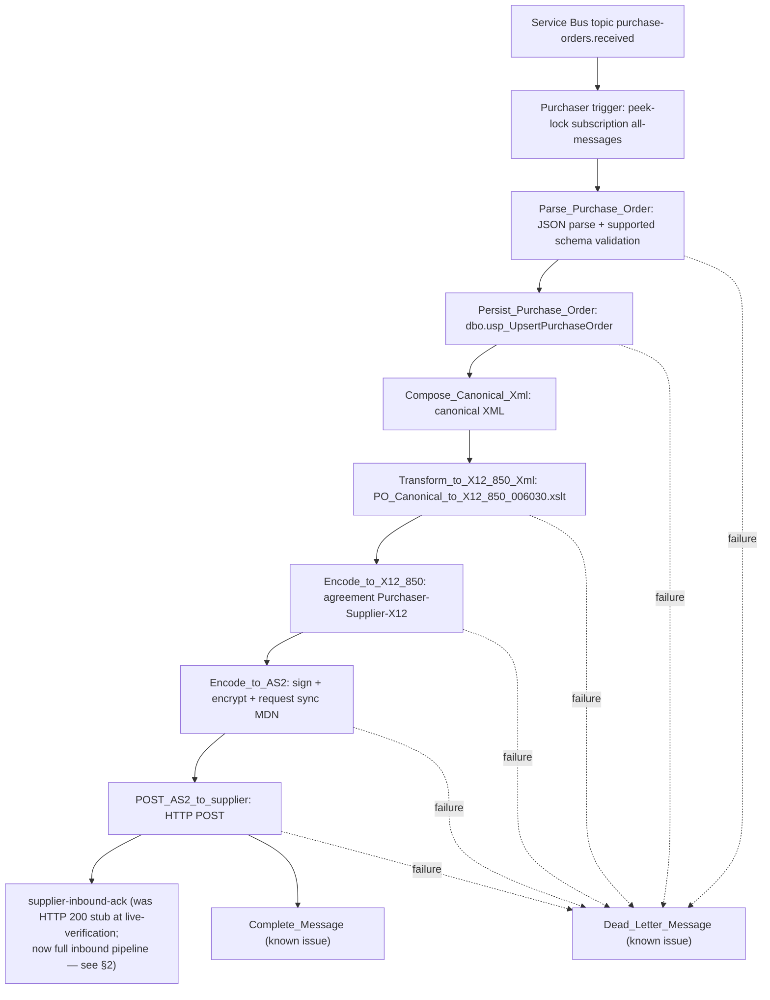

# End-to-End EDI Flow — Purchaser PO, Supplier 850 Receive, and 997 Return

> **Status — purchaser send path (2026-07-20T14:35:00-05:00):** Verified live through supplier HTTP 200. Service Bus settlement remains open.
> **Status — supplier receive + 997 return path (2026-07-21):** AUTHORED on branch `feature/supplier-inbound-997-workflow`; not yet deployed or live-verified. Workflow `.json` files, Bicep, SQL DDL, and the XSLT map are committed on this branch but no live round-trip has been executed. See §2 and the authoritative design at [`docs/supplier-workflow-epic-design.md`](supplier-workflow-epic-design.md).

## 1. Purchaser send path (live-verified)

### Action-by-action notes — purchaser send

| Step | Runtime detail |
|---|---|
| Input | `samples/purchase-order-e2e-test.json` or another non-sensitive canonical PO JSON is published to Service Bus topic `purchase-orders.received`. |
| Parse | `Parse_Purchase_Order` uses Logic Apps Parse JSON. Regex `pattern` is unsupported, so currency/state/country validation is currently length-only. |
| Persist | Purchaser SQL connection uses managed identity with concrete SQL connection values in `logicapps/purchaser/connections.json`; `dbo.usp_UpsertPurchaseOrder` is idempotent on `PoNumber`. |
| Canonical XML | `Compose_Canonical_Xml` emits the XML consumed by the map; downstream XSLT reads it with `outputs('Compose_Canonical_Xml')`. |
| Transform | `PO_Canonical_to_X12_850_006030.xslt` produces XML rooted at `X12_00603_850` in namespace `http://schemas.microsoft.com/BizTalk/EDI/X12/2006`. |
| X12 encode | Uses Integration Account agreement `Purchaser-Supplier-X12`. The send-side schema reference intentionally omits `senderApplicationId`; the envelope still uses `senderApplicationId = PURCHASER01`. |
| AS2 encode | Standard built-in AS2 v2 returns `messageContent.$content` and `messageHeaders`. The HTTP body decodes `$content` with `base64ToBinary(...)`. |
| Supplier POST | `POST_AS2_to_supplier` reads the clean app setting `SupplierAs2EndpointUrl` and posts to the supplier callback URL stored in Key Vault. |
| Supplier | `supplier-inbound-ack` is a stub that returns HTTP 200 and body `"AS2 message received."`. |
| Settlement | Intended: complete on success, dead-letter on failure. Current state: `Complete_Message` errors `VNetPrivatePortsNotConfigured` and messages may redeliver. Cause/fix TBD. |

## Verification evidence to look for

A successful live business-processing path shows the purchaser run actions through `POST_AS2_to_supplier` as `Succeeded`, with `POST_AS2_to_supplier` returning status code `200`. The supplier run history should show a corresponding `supplier-inbound-ack` run with `Return_200_OK: Succeeded`.

Do not treat Service Bus message completion as green until the settlement issue is fixed.
