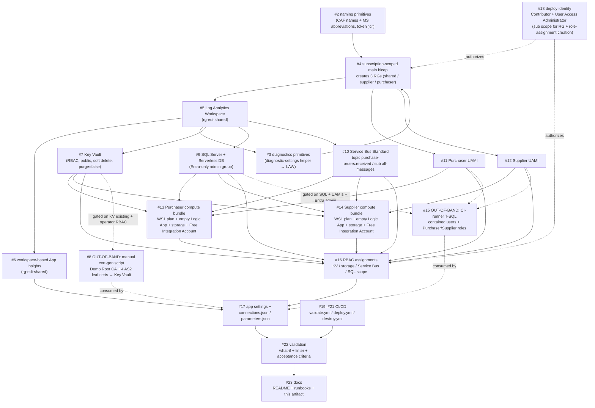

# Infrastructure Deploy Ordering — Design Artifact

> **Owner:** Mal (Lead / Integration Architect) · **Status:** Locked (dev) · **Date:** 2026-07-16
> **Scope:** Design + documentation only. No Bicep, no workflow code, no deployment is performed here.
> This artifact is the contract for the deploy ordering. Kaylee builds the Bicep to match it; Wash
> authors workflows against the empty Logic Apps it provisions; Zoe validates the trust boundaries.

## 1. Purpose

The environment is provisioned by **one subscription-scoped Bicep deployment**
(`targetScope='subscription'`) that creates the three resource groups and every resource inside them
(per the Infrastructure Engineering Spec). Because a single deployment fans out across three resource
groups and multiple resource families with hard data-plane and RBAC dependencies, the **order in which
modules are declared and referenced is itself an architectural decision**. This document fixes that order,
explains why each constraint exists, and cleanly separates the two operations that are intentionally
**not** part of the Bicep deployment.

## 2. Confirmed parameters (locked by Christopher House, 2026-07-16)

| Parameter | Value |
|---|---|
| Subscription | `8bd05b2f-62c5-4def-9869-f0617ebb3970` |
| Tenant | `76de2d2d-77f8-438d-9a87-01806f2345da` |
| Resource groups | `rg-edi-shared` (Central US), `rg-edi-supplier` (Central US), `rg-edi-purchaser` (East US 2) |
| Naming token | `jci` (CAF naming + MS resource abbreviations) |
| Environment | `dev` only |
| SQL admin | Entra **group** object id `b9dac399-abc0-479d-9900-f2115a98297d`; Entra-only auth; lowest-cost Serverless |
| Key Vault | RBAC auth; public network; soft delete **on**; purge protection **false** (default) |
| Logic Apps runtime | `WEBSITE_NODE_DEFAULT_VERSION = ~22` |
| Demo posture | every resource tagged `SecurityControl=Ignore`; Public Network Access enabled; no VNet / private endpoints |
| Identity model | Managed identity only (UAMI preferred); no connection strings unless forced by the Windows hosting model (then documented + Key Vault referenced) |

## 3. Module dependency graph

Nodes are modules/bundles; edges mean "must be resolvable before". The graph is a DAG; the strict
sequence in §4 is one valid topological order of it. Work-item numbers (`#n`) are shown per node.

## 4. Strict deploy sequence (with rationale)

Each row is a hard ordering constraint: the step **cannot** be resolved until every predecessor is
resolvable. "Resolvable" means the resource id / endpoint / principal id the successor consumes is known.

| # | Step | Work item | Depends on | Why it must precede the next |
|---|------|-----------|------------|------------------------------|
| 1 | **Naming primitives** — compute deterministic CAF names from token `jci` + MS abbreviations. Pure functions/vars, no resources. | #2 | — | Every downstream module consumes these names; they must be materialized first so names are stable and idempotent. |
| 2 | **Diagnostics primitives** — a reusable diagnostic-settings helper that targets the shared LAW. | #3 | naming; (LAW id at apply time) | Centralizes the `allLogs → LAW` wiring every resource reuses. Declared early but its LAW target is bound once #5 exists. |
| 3 | **Subscription-scoped `main.bicep` → 3 resource groups** (`rg-edi-shared`, `rg-edi-supplier`, `rg-edi-purchaser`). | #4 | naming; deploy identity (#18) | Resource groups are the containers; **nothing can be scoped into an RG that does not exist**. A subscription-scoped deployment must create the RGs before any RG-scoped module runs. |
| 4 | **Shared tier — Log Analytics Workspace** (rg-edi-shared). | #5 | RGs (#4) | LAW is the single diagnostics sink. Every later resource's diagnostic settings reference its id, so it must exist before any resource that exports logs. |
| 5 | **Shared tier — workspace-based Application Insights** (rg-edi-shared). | #6 | LAW (#5) | Workspace-based App Insights requires the LAW resource id at create time; its connection string later feeds `APPLICATIONINSIGHTS_CONNECTION_STRING` in app settings. |
| 6 | **Key Vault** (RBAC auth, public network, soft delete on, purge protection false). | #7 | RGs (#4); LAW (#5) for diagnostics | KV must exist before (a) the out-of-band cert script can publish certs into it and (b) apps get *Key Vault Secrets/Certificate User* RBAC. It gates the cert material the AS2 flow depends on. |
| 7 | **Azure SQL Server + lowest-cost Serverless DB** (Entra-only auth; admin = Entra group `b9da…297d`). | #9 | RGs (#4); LAW (#5) | SQL must exist before the CI-runner T-SQL step (#15) can create contained users/roles, and before apps get SQL data-plane access. Entra-only admin group must be set at server create so the CI token can authenticate. |
| 8 | **Service Bus Standard namespace** + topic `purchase-orders.received` + subscription `all-messages`. | #10 | RGs (#4); LAW (#5) | The namespace and its entities must exist before Sender/Receiver RBAC is assigned and before `connections.json` can reference the fully-qualified namespace. |
| 9 | **Per-app User-Assigned Managed Identities** — Purchaser UAMI, Supplier UAMI. | #11, #12 | RGs (#4) | The UAMI **principal ids** are the grantees for every RBAC assignment (KV, storage, Service Bus, SQL) and the `clientId` values injected into app settings. They must exist before RBAC (#16) and before compute binds an identity. |
| 10 | **Purchaser compute bundle** — WS1 Workflow Standard plan (Windows), empty Logic App Standard, storage account, Free Integration Account (rg-edi-purchaser, East US 2). | #13 | UAMI (#11); KV (#7); SQL (#9); SB (#10); LAW (#5) | The Logic App must attach the Purchaser UAMI at create time and reference host storage; the Integration Account is the empty container future EDI artifacts bind to. Storage must exist before storage-runtime RBAC and before `AzureWebJobsStorage__accountName` is set. |
| 11 | **Supplier compute bundle** — WS1 plan (Windows), empty Logic App Standard, storage account, Free Integration Account (rg-edi-supplier, Central US). | #14 | UAMI (#12); KV (#7); SQL (#9); SB (#10); LAW (#5) | Same rationale as #10, for the supplier side and its distinct identity/region. |
| 12 | **RBAC assignments** — least-privilege, per identity (see §5). | #16 | UAMIs (#11/#12); KV (#7); storage (in #13/#14); SB (#10); SQL server scope (#9) | Both the grantee (UAMI principal id) and the scope (target resource id) must already exist. RBAC is deliberately after compute so storage-account scopes are known, and before app settings so runtime identity works on first start. |
| 13 | **App settings + `connections.json` / `parameters.json`** — inject App Insights connection string, `WEBSITE_NODE_DEFAULT_VERSION=~22`, `APP_KIND=workflowApp`, `FUNCTIONS_*`, managed-identity host-storage settings, and the built-in-connector identity prefixes (`<conn>__fullyQualifiedNamespace`, `<conn>__credential=managedidentity`, `<conn>__clientId`). | #17 | AI (#6); RBAC (#16); SB (#10); SQL (#9); KV (#7) + out-of-band cert/SQL outputs | Settings reference endpoints/ids from all prior tiers; runtime auth only works once RBAC and (out-of-band) SQL users/certs are in place. No `Microsoft.Web/connections`; built-in connectors only. |
| 14 | **CI/CD** — `validate.yml`, `deploy.yml`, `destroy.yml`. | #19–#21 | main.bicep graph (#4–#17) | The pipelines orchestrate the above as a unit and host the out-of-band SQL step (#15); they encode the same ordering and the destroy path (reverse order, honoring KV soft delete). |
| 15 | **Validation** — clean `what-if`, clean Bicep linter, acceptance-criteria check. | #22 | everything above | Proves idempotency and that the ordering yields a clean plan before docs are finalized. |
| 16 | **Docs** — README, runbooks (incl. the two out-of-band runbooks), and this artifact. | #23 | validated environment (#22) | Documentation reflects the verified, as-built ordering rather than intent. |

### Destroy ordering (for `destroy.yml`, #21)

Tear down in **reverse dependency order**: app settings/connections → RBAC → compute bundles → Service
Bus → SQL → Key Vault → shared (App Insights → LAW) → resource groups. **Key Vault soft delete is on**
(purge protection **false**), so a redeploy with the same name must either recover the soft-deleted vault
or purge it first — call this out in the destroy runbook.

## 5. Trust-boundary notes

The purchaser and supplier are **two separate Logic App Standard apps with two distinct identities**.
Keeping their responsibilities and permissions disjoint is the core trust boundary of the demo.

- **Two app identities, never shared:**
  - **Purchaser UAMI** → **Azure Service Bus Data Sender** on the namespace. It publishes to
    `purchase-orders.received`. It must **not** receive.
  - **Supplier UAMI** → **Azure Service Bus Data Receiver** on the namespace. It consumes from the
    `all-messages` subscription. It must **not** send.
- **Least-privilege RBAC (per app):**
  - Key Vault: **Secrets User** + **Certificate User** (read-only data plane; no management-plane rights).
  - Storage: storage-runtime **data-plane** role on that app's **own** storage account only.
  - SQL: contained user mapped to a custom role — **PurchaserRole = SELECT, EXECUTE**;
    **SupplierRole = INSERT, EXECUTE**; **never `db_owner`** (enforced out-of-band in #15).
  - Service Bus: exactly one directional role each, as above.
- **Managed identity only:** no connection strings anywhere unless the Windows hosting model forces an
  Azure Files connection string; if forced, it is **documented and Key Vault-referenced**, never inline.
  Host storage uses `AzureWebJobsStorage__credential=managedidentity` with `__accountName` / `__clientId`.
- **No `Microsoft.Web/connections`:** built-in connectors only, authenticated via the connection-prefix
  identity model in `connections.json` / `parameters.json`. No manual connection authorization.
- **Cross-region boundary:** purchaser (East US 2) and supplier (Central US) are deliberately in separate
  RGs/regions; the shared tier (Central US) is the only common scope, reinforcing identity separation.

## 6. Out-of-band operations (NOT part of the Bicep deployment)

These two steps are **intentionally excluded** from `main.bicep`. Neither is a Bicep Deployment Script.
They exist because their inputs (an operator/CI Entra token, private-key generation) do not belong in an
idempotent infrastructure deployment, and the spec forbids Deployment Scripts without explicit approval.

### 6a. Manual cert-generation script → Key Vault (#8)

- **What:** A **manually run** script generates a **Demo Root CA** and **four AS2 leaf certificates**
  (Purchaser Signing, Purchaser Encryption, Supplier Signing, Supplier Encryption) and publishes them to
  Key Vault. Documented by Book.
- **What it is NOT:** not a Bicep resource, **not** a Bicep Deployment Script, and **not** part of
  `deploy.yml`. It is a one-time operator action.
- **Where it sits in the sequence:** **after Key Vault (#7)** and **before app settings / first app start
  (#13)** — i.e., between deploy sequence steps 6 and 13. The AS2 flow cannot function without the certs,
  but the infra deployment completes without them.
- **Depends on:** Key Vault existing (#7) **and** the operator principal holding Key Vault
  **Certificates Officer / Secrets Officer** rights to write the material. (Apps only get *User* roles.)
- **Consumed by:** Logic App app settings / `connections.json` cert references (#17) and, at runtime, the
  AS2 encode/decode + MDN signing steps (future work item).

### 6b. CI-runner SQL user/role step (#15)

- **What:** A **CI / GitHub-runner** step acquires an **Entra access token** (as a member of the SQL
  admin group `b9da…297d`) and runs T-SQL that creates **contained users for both UAMIs** and the two
  custom roles: **PurchaserRole (SELECT, EXECUTE)**, **SupplierRole (INSERT, EXECUTE)**. **No `db_owner`.**
- **What it is NOT:** not expressible in Bicep (data-plane T-SQL), and **not** a Deployment Script. It
  runs as a pipeline step in `deploy.yml`.
- **Where it sits in the sequence:** **after SQL (#9) and after both UAMIs (#11/#12)**, and **after** the
  Entra-only admin group is set on the server — i.e., immediately following deploy sequence step 9,
  before app settings (#17). Practically it runs as a post-`main.bicep` job in `deploy.yml`.
- **Depends on:** SQL server + DB (#9), Entra-only admin group being the server admin, both UAMI principal
  ids/names (#11/#12), and a runner token whose identity is in the admin group.
- **Consumed by:** the Logic Apps' SQL built-in connection at runtime (#17); until it runs, the apps have
  no database principal even though RBAC/networking are in place.

## 7. Open scope note — deploy identity RG-vs-subscription reconciliation (#18)

The deploying principal needs **Contributor + User Access Administrator**. Because the **resource groups
are created by the subscription-scoped deployment itself** (not pre-created), the identity must hold these
roles at a **scope that covers RG creation *and* role-assignment creation** — i.e., at the **subscription**
scope, not merely at the (not-yet-existing) resource-group scope.

- **The tension:** RG-scoped grants cannot authorize creating the RGs, and RBAC assignments (#16) require
  **User Access Administrator** at a scope enclosing the targets. Both point to subscription-scope grants.
- **Reconciliation to resolve before deploy (owner: coordinator + Zoe):**
  - Grant **Contributor** and **User Access Administrator** to the deploy identity at **subscription**
    scope (`/subscriptions/8bd05b2f-…`), OR
  - Pre-create the three RGs out-of-band and narrow the identity to RG-scoped grants (rejected for now —
    conflicts with the spec's "one subscription-scoped deployment creates all RGs").
  - Confirm the identity used by `deploy.yml` (federated credential / OIDC) carries these subscription-
    scope assignments **before** first deploy; otherwise `main.bicep` (step 3) fails at RG creation and
    RBAC (step 12) fails at assignment creation.
- **Status:** OPEN — flagged for the deploy-identity work item (#18). Does not block design; blocks first
  successful `deploy.yml` run.

## 8. Work-item index (this artifact's mapping)

| # | Work item | Deploy sequence step |
|---|-----------|----------------------|
| #2 | Naming primitives | 1 |
| #3 | Diagnostics primitives | 2 |
| #4 | Subscription-scoped main.bicep + 3 RGs | 3 |
| #5 | Log Analytics Workspace | 4 |
| #6 | Workspace-based Application Insights | 5 |
| #7 | Key Vault | 6 |
| #8 | **Out-of-band:** manual cert-gen → Key Vault | between 6 and 13 |
| #9 | SQL Server + Serverless DB | 7 |
| #10 | Service Bus namespace + topic + subscription | 8 |
| #11 | Purchaser UAMI | 9 |
| #12 | Supplier UAMI | 9 |
| #13 | Purchaser compute bundle | 10 |
| #14 | Supplier compute bundle | 11 |
| #15 | **Out-of-band:** CI-runner SQL users/roles | after 7 (+#11/#12), before 13 |
| #16 | RBAC assignments | 12 |
| #17 | App settings + connections.json/parameters.json | 13 |
| #18 | Deploy identity (Contributor + UAA) — see §7 | authorizes 3 & 12 |
| #19 | CI: validate.yml | 14 |
| #20 | CI: deploy.yml | 14 |
| #21 | CI: destroy.yml | 14 |
| #22 | Validation (what-if / linter / acceptance) | 15 |
| #23 | Docs | 16 |

---
*Authored by Mal. The flow diagram is the contract: if the ordering isn't in this artifact, it doesn't
ship. Implementation (Bicep) is owned by Kaylee and must conform to this sequence.*
