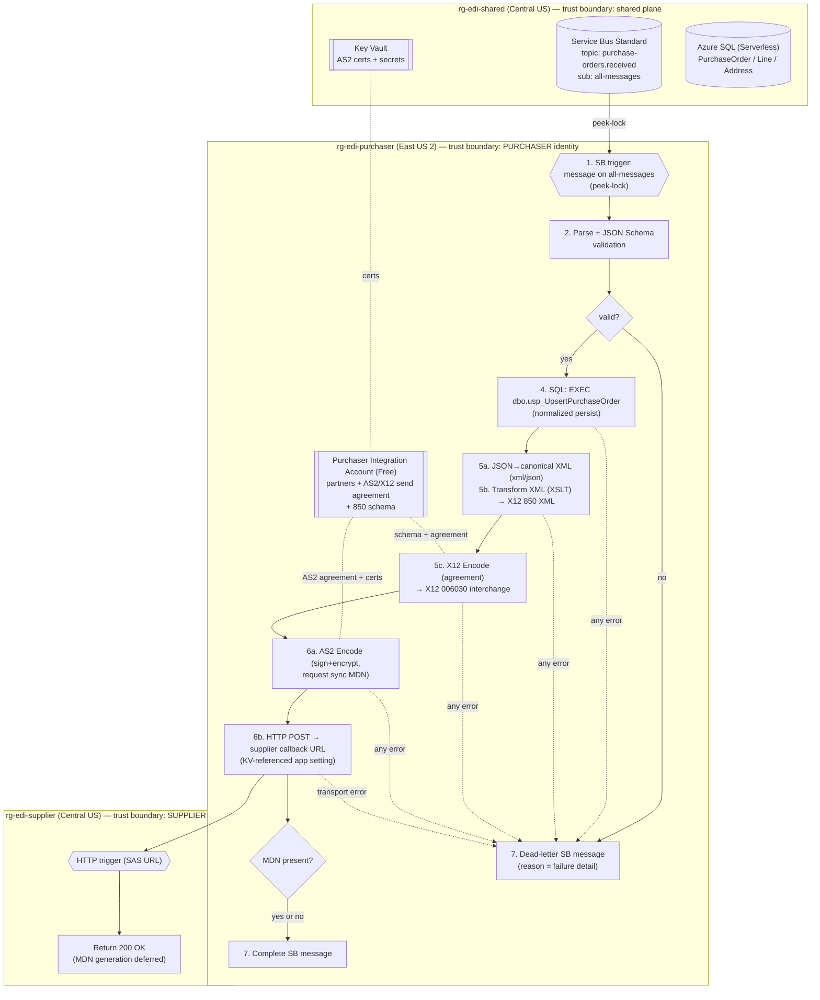
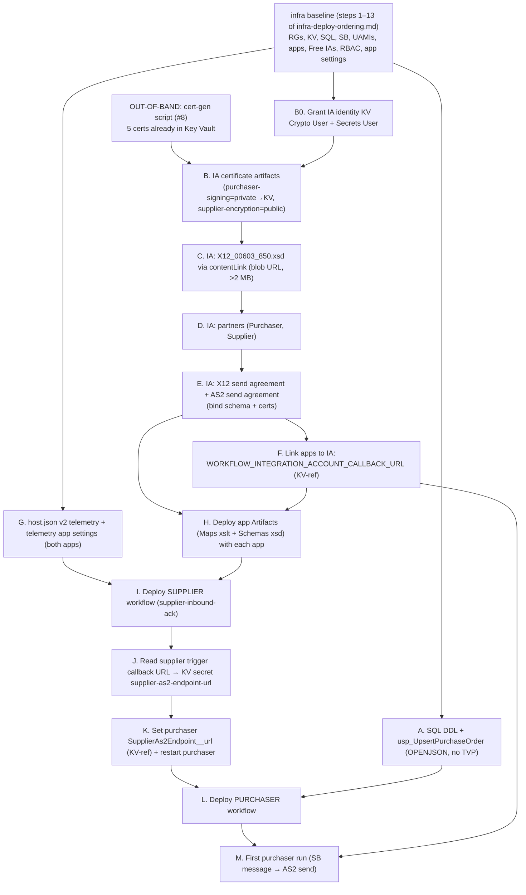

# Purchaser Workflow Epic — Authoritative Design

> **Owner:** Mal (Lead / Integration Architect) · **Status:** Locked design (dev) · **Date:** 2026-07-17
> **Branch:** `feature/purchaser-po-to-as2-850-workflow` · **Scope:** DESIGN ONLY — no Bicep, workflow.json,
> xsd, or xslt is authored here. This document is the contract the specialists build from.
> **Do NOT merge anything from this epic** (owner directive).

This artifact extends the locked infrastructure design (`docs/infra-deploy-ordering.md`) with the
application layer: the purchaser workflow that turns a canonical Purchase Order message on Service Bus
into a signed + encrypted **X12 850 (006030)** AS2 transmission to the supplier, plus the supplier's
minimal HTTP-triggered acknowledgment endpoint. Every locked product-owner decision (see §0) is treated
as fixed; this document makes them concrete and buildable.

---

## 0. Locked inputs (do not relitigate)

| # | Decision |
|---|----------|
| 1 | Build real EDI artifacts now: 850 schema, XSLT map, trading partners, AS2 agreement in the Integration Account. |
| 2 | Mal designs a representative **canonical PO JSON** (header + lines + ship-to/bill-to). |
| 3 | SQL is **normalized**: `PurchaseOrder` + `PurchaseOrderLine` + `Address`, persisted via a stored procedure. |
| 4 | X12 **850 v006030** (Microsoft's official schema, root `X12_00603_850`, `standards_version="00603"`); ZZ qualifiers + mutually-agreed IDs. |
| 5 | AS2 send: **sign + encrypt**, sync MDN **requested but non-fatal**. |
| 6 | Supplier HTTP trigger uses a SAS-signed URL; CI deploys **supplier first**, extracts the callback URL, injects it into a purchaser app setting as a **Key Vault reference**. |
| 7 | Settlement: **dead-letter** on validation failure/error; **complete** on success. |
| 8 | **v2 telemetry** on both Logic Apps (App Insights + Workflows runtime telemetry). |

Infrastructure constraints inherited and unchanged: **managed identity only**, **built-in connectors
only**, **no `Microsoft.Web/connections`**, public network + `SecurityControl=Ignore` are intentional demo
posture, purchaser UAMI = Service Bus **Data Sender**, supplier UAMI = Service Bus **Data Receiver**.

---

## 1. End-to-end flow (the contract)



**Trust boundaries.** Three: (a) the **shared plane** (SB/KV/SQL) that both identities touch with disjoint
least-privilege rights; (b) the **purchaser** identity (East US 2) which may *send* to SB, *read* KV certs,
*execute*+*select* SQL, and POST outbound AS2; (c) the **supplier** identity (Central US) which may *receive*
from SB and exposes only a SAS-gated HTTP endpoint. The purchaser never receives; the supplier never sends
to SB. The only purchaser→supplier link is the outbound AS2 HTTPS POST to a SAS-signed callback URL.

**Dead-letter path.** Any failure — schema-invalid payload, SQL error, transform/encode error, AS2 error, or
transport failure on the POST — routes to **dead-letter the Service Bus message with a reason**. Only a fully
successful send (regardless of MDN presence) **completes** the message. This is a run-scoped `Scope` +
`runAfter: [Failed, TimedOut]` handler that calls the built-in Service Bus **Dead-letter** operation.

> **Settlement key (contract).** The peek-lock trigger (`peekLockTopicMessages`) emits a broker **`lockToken`**.
> Both the `completeMessage` and `deadLetterMessage` built-in service-provider operations settle **by
> `lockToken`** (`@triggerBody()?['lockToken']`) — **not** by `messageId`. `messageId` is a producer-set
> idempotency/dedup value and does **not** resolve the broker lock; using it fails settlement and the message
> is redelivered on lock expiry.

**MDN is non-fatal.** A sync MDN is *requested* on the AS2 Encode/send, but the `MDN present?` branch treats
both outcomes as success for settlement. A missing/negative MDN is logged (custom tracked property) but does
**not** trigger dead-letter. (Per §0.5 and locked decision #5.)

---

## 2. Canonical Purchase Order — example + JSON Schema

### 2.1 Representative payload (`samples/purchase-order.sample.json`)

```json
{
  "purchaseOrder": {
    "poNumber": "PO-2026-0001",
    "orderDate": "2026-07-17",
    "requestedDeliveryDate": "2026-07-31",
    "currency": "USD",
    "buyer":  { "id": "PURCHASER01", "name": "Contoso Buying Co" },
    "seller": { "id": "SUPPLIER01",  "name": "Fabrikam Supply Co" },
    "shipTo": {
      "name": "Contoso DC West",
      "line1": "100 Warehouse Way",
      "line2": null,
      "city": "Tacoma",
      "state": "WA",
      "postalCode": "98402",
      "country": "US"
    },
    "billTo": {
      "name": "Contoso Accounts Payable",
      "line1": "1 Contoso Plaza",
      "line2": "Suite 400",
      "city": "Redmond",
      "state": "WA",
      "postalCode": "98052",
      "country": "US"
    },
    "lines": [
      { "lineNumber": 1, "sku": "SKU-1001", "description": "Widget, 10mm",  "quantity": 120, "uom": "EA", "unitPrice": 2.50 },
      { "lineNumber": 2, "sku": "SKU-2002", "description": "Gadget, blue",  "quantity": 40,  "uom": "EA", "unitPrice": 9.99 },
      { "lineNumber": 3, "sku": "SKU-3003", "description": "Bracket, steel","quantity": 500, "uom": "EA", "unitPrice": 0.75 }
    ]
  }
}
```

### 2.2 JSON Schema for validation (`samples/purchase-order.schema.json`, draft 2020-12)

Used by the workflow's **Parse JSON** + a validation gate (the built-in **Data Operations → Parse JSON**
enforces the schema; on parse failure the run branches to dead-letter). Required fields, types, and formats:

```jsonc
{
  "$schema": "https://json-schema.org/draft/2020-12/schema",
  "$id": "https://edi-demo/schemas/purchase-order.schema.json",
  "type": "object",
  "required": ["purchaseOrder"],
  "additionalProperties": false,
  "properties": {
    "purchaseOrder": {
      "type": "object",
      "additionalProperties": false,
      "required": ["poNumber","orderDate","currency","buyer","seller","shipTo","billTo","lines"],
      "properties": {
        "poNumber":              { "type": "string", "minLength": 1, "maxLength": 22 },
        "orderDate":             { "type": "string", "format": "date" },
        "requestedDeliveryDate": { "type": "string", "format": "date" },
        "currency":              { "type": "string", "pattern": "^[A-Z]{3}$" },
        "buyer":  { "$ref": "#/$defs/party" },
        "seller": { "$ref": "#/$defs/party" },
        "shipTo": { "$ref": "#/$defs/address" },
        "billTo": { "$ref": "#/$defs/address" },
        "lines": {
          "type": "array", "minItems": 1,
          "items": { "$ref": "#/$defs/line" }
        }
      }
    }
  },
  "$defs": {
    "party": {
      "type": "object", "additionalProperties": false,
      "required": ["id","name"],
      "properties": {
        "id":   { "type": "string", "minLength": 1, "maxLength": 15 },
        "name": { "type": "string", "minLength": 1, "maxLength": 60 }
      }
    },
    "address": {
      "type": "object", "additionalProperties": false,
      "required": ["name","line1","city","state","postalCode","country"],
      "properties": {
        "name":       { "type": "string", "minLength": 1, "maxLength": 60 },
        "line1":      { "type": "string", "minLength": 1, "maxLength": 55 },
        "line2":      { "type": ["string","null"], "maxLength": 55 },
        "city":       { "type": "string", "minLength": 1, "maxLength": 30 },
        "state":      { "type": "string", "pattern": "^[A-Z]{2}$" },
        "postalCode": { "type": "string", "minLength": 3, "maxLength": 15 },
        "country":    { "type": "string", "pattern": "^[A-Z]{2}$" }
      }
    },
    "line": {
      "type": "object", "additionalProperties": false,
      "required": ["lineNumber","sku","quantity","uom","unitPrice"],
      "properties": {
        "lineNumber":  { "type": "integer", "minimum": 1 },
        "sku":         { "type": "string", "minLength": 1, "maxLength": 30 },
        "description": { "type": "string", "maxLength": 80 },
        "quantity":    { "type": "number", "exclusiveMinimum": 0 },
        "uom":         { "type": "string", "minLength": 1, "maxLength": 2 },
        "unitPrice":   { "type": "number", "minimum": 0 }
      }
    }
  }
}
```

Field-length caps are deliberately chosen to fit their downstream X12 element limits (see §4) so a payload
that passes validation cannot overflow an 850 element.

---

## 3. SQL relational model + stored-procedure contract

Normalized, three tables, all in schema `dbo`. Surrogate identity PKs; `poNumber` is the natural business key
(unique). Addresses are normalized into a shared `Address` table referenced by the header (ship-to + bill-to).

### 3.1 DDL sketch (`infra/sql/schema/010-tables.sql`)

```sql
CREATE TABLE dbo.[Address] (
    AddressId    INT IDENTITY(1,1) NOT NULL CONSTRAINT PK_Address PRIMARY KEY,
    Name         NVARCHAR(60)  NOT NULL,
    Line1        NVARCHAR(55)  NOT NULL,
    Line2        NVARCHAR(55)  NULL,
    City         NVARCHAR(30)  NOT NULL,
    [State]      CHAR(2)       NOT NULL,
    PostalCode   NVARCHAR(15)  NOT NULL,
    Country      CHAR(2)       NOT NULL
);

CREATE TABLE dbo.PurchaseOrder (
    PurchaseOrderId       INT IDENTITY(1,1) NOT NULL CONSTRAINT PK_PurchaseOrder PRIMARY KEY,
    PoNumber              VARCHAR(22)   NOT NULL CONSTRAINT UQ_PurchaseOrder_PoNumber UNIQUE,  -- business key
    OrderDate             DATE          NOT NULL,
    RequestedDeliveryDate DATE          NULL,
    Currency              CHAR(3)       NOT NULL,
    BuyerId               VARCHAR(15)   NOT NULL,
    BuyerName             NVARCHAR(60)  NOT NULL,
    SellerId              VARCHAR(15)   NOT NULL,
    SellerName            NVARCHAR(60)  NOT NULL,
    ShipToAddressId       INT           NOT NULL CONSTRAINT FK_PO_ShipTo REFERENCES dbo.[Address](AddressId),
    BillToAddressId       INT           NOT NULL CONSTRAINT FK_PO_BillTo REFERENCES dbo.[Address](AddressId),
    ReceivedUtc           DATETIME2(3)  NOT NULL CONSTRAINT DF_PO_ReceivedUtc DEFAULT SYSUTCDATETIME()
);

CREATE TABLE dbo.PurchaseOrderLine (
    PurchaseOrderLineId INT IDENTITY(1,1) NOT NULL CONSTRAINT PK_PurchaseOrderLine PRIMARY KEY,
    PurchaseOrderId     INT           NOT NULL CONSTRAINT FK_POL_PO REFERENCES dbo.PurchaseOrder(PurchaseOrderId),
    LineNumber          INT           NOT NULL,
    Sku                 VARCHAR(30)   NOT NULL,
    [Description]       NVARCHAR(80)  NULL,
    Quantity            DECIMAL(18,4) NOT NULL,
    Uom                 VARCHAR(2)    NOT NULL,
    UnitPrice           DECIMAL(18,4) NOT NULL,
    CONSTRAINT UQ_POL_PO_Line UNIQUE (PurchaseOrderId, LineNumber)
);
```

### 3.2 Stored-procedure contract (`infra/sql/schema/020-usp-upsert.sql`)

**`dbo.usp_UpsertPurchaseOrder`** — one call persists the whole PO atomically. Header + addresses scalar
params; lines passed as a **JSON string** (`@LinesJson NVARCHAR(MAX)`) shredded with `OPENJSON`. **Rationale:**
the built-in Logic Apps **SQL connector cannot pass a table-valued parameter** (Wash's build finding), so a TVP
is not an option — the workflow serializes the `lines` array to JSON and the proc shreds it. This removes the
`dbo.PurchaseOrderLineType` TVP type and its `GRANT EXECUTE ON TYPE`.

```sql
CREATE OR ALTER PROCEDURE dbo.usp_UpsertPurchaseOrder
    @PoNumber              VARCHAR(22),
    @OrderDate             DATE,
    @RequestedDeliveryDate DATE = NULL,
    @Currency              CHAR(3),
    @BuyerId  VARCHAR(15),  @BuyerName  NVARCHAR(60),
    @SellerId VARCHAR(15),  @SellerName NVARCHAR(60),
    -- ship-to
    @ShipToName NVARCHAR(60), @ShipToLine1 NVARCHAR(55), @ShipToLine2 NVARCHAR(55) = NULL,
    @ShipToCity NVARCHAR(30), @ShipToState CHAR(2), @ShipToPostalCode NVARCHAR(15), @ShipToCountry CHAR(2),
    -- bill-to
    @BillToName NVARCHAR(60), @BillToLine1 NVARCHAR(55), @BillToLine2 NVARCHAR(55) = NULL,
    @BillToCity NVARCHAR(30), @BillToState CHAR(2), @BillToPostalCode NVARCHAR(15), @BillToCountry CHAR(2),
    -- lines as JSON array: [{"lineNumber":1,"sku":"...","description":"...","quantity":120,"uom":"EA","unitPrice":2.50}, ...]
    @LinesJson NVARCHAR(MAX)
AS
BEGIN
    SET NOCOUNT ON; SET XACT_ABORT ON;
    BEGIN TRAN;
      -- idempotency: a re-delivered SB message must not duplicate. If PoNumber exists, no-op + return existing id.
      DECLARE @PurchaseOrderId INT =
          (SELECT PurchaseOrderId FROM dbo.PurchaseOrder WHERE PoNumber = @PoNumber);
      IF @PurchaseOrderId IS NULL
      BEGIN
        DECLARE @ShipId INT, @BillId INT;
        INSERT dbo.[Address](Name,Line1,Line2,City,[State],PostalCode,Country)
          VALUES(@ShipToName,@ShipToLine1,@ShipToLine2,@ShipToCity,@ShipToState,@ShipToPostalCode,@ShipToCountry);
        SET @ShipId = SCOPE_IDENTITY();
        INSERT dbo.[Address](Name,Line1,Line2,City,[State],PostalCode,Country)
          VALUES(@BillToName,@BillToLine1,@BillToLine2,@BillToCity,@BillToState,@BillToPostalCode,@BillToCountry);
        SET @BillId = SCOPE_IDENTITY();
        INSERT dbo.PurchaseOrder(PoNumber,OrderDate,RequestedDeliveryDate,Currency,
              BuyerId,BuyerName,SellerId,SellerName,ShipToAddressId,BillToAddressId)
          VALUES(@PoNumber,@OrderDate,@RequestedDeliveryDate,@Currency,
              @BuyerId,@BuyerName,@SellerId,@SellerName,@ShipId,@BillId);
        SET @PurchaseOrderId = SCOPE_IDENTITY();
        INSERT dbo.PurchaseOrderLine(PurchaseOrderId,LineNumber,Sku,[Description],Quantity,Uom,UnitPrice)
          SELECT @PurchaseOrderId, j.LineNumber, j.Sku, j.[Description], j.Quantity, j.Uom, j.UnitPrice
          FROM OPENJSON(@LinesJson) WITH (
              LineNumber  INT           '$.lineNumber',
              Sku         VARCHAR(30)   '$.sku',
              [Description] NVARCHAR(80) '$.description',
              Quantity    DECIMAL(18,4) '$.quantity',
              Uom         VARCHAR(2)    '$.uom',
              UnitPrice   DECIMAL(18,4) '$.unitPrice'
          ) AS j;
      END
    COMMIT TRAN;
    SELECT @PurchaseOrderId AS PurchaseOrderId;   -- returned to the workflow
END
```

**Keying / idempotency.** `PoNumber` is the business key (`UNIQUE`); `PurchaseOrderId` is the surrogate.
The proc is idempotent on `PoNumber` so a Service Bus **redelivery** (peek-lock renewal expiry, retries) does
not create duplicates — critical because settlement is at-least-once. The proc returns `PurchaseOrderId` for
workflow tracking.

**GRANT.** `PurchaserRole` already has `GRANT EXECUTE ON SCHEMA::dbo` and `GRANT SELECT ON SCHEMA::dbo`
(see `infra/sql/create-users-roles.sql`), so it can `EXEC dbo.usp_UpsertPurchaseOrder` and read back the
result **with no new grant at all**. Because lines arrive as a JSON string shredded by `OPENJSON` (no TVP),
there is **no `GRANT EXECUTE ON TYPE`** and **no TVP type** to create. No `INSERT`/table-level grant is needed
because all writes happen *inside* the proc under its own ownership chain — the purchaser never gets direct
table `INSERT`.

---

## 4. X12 850 (006030) mapping specification

### 4.1 Envelope (ISA / GS / ST) — demo values + control-number strategy

| Level | Element | Value | Notes |
|-------|---------|-------|-------|
| ISA05/ISA07 | Sender/Receiver ID Qualifier | `ZZ` | Mutually-agreed (locked #4). |
| ISA06 | Interchange Sender ID | `PURCHASER01    ` | 15 chars, space-padded. Matches `buyer.id`. |
| ISA08 | Interchange Receiver ID | `SUPPLIER01     ` | Matches `seller.id`. |
| ISA11 | Repetition separator | `U` | Kept `U` (006030 still accepts the standard repetition separator). |
| ISA12 | Interchange Ctrl Version | `00603` | 006030 interchange control version. |
| ISA13 | Interchange Control Number | `%000000001%` | 9-digit, from IA X12 agreement's control-number generator (auto-increment per interchange). |
| ISA14 | Ack requested (TA1) | `0` | No TA1 for this demo. |
| ISA15 | Usage indicator | `T` | **T = Test** (demo posture). |
| ISA16 | Component element separator | `>` | |
| GS01 | Functional ID code | `PO` | 850 = Purchase Order. |
| GS02 | Application Sender Code | `PURCHASER01` | |
| GS03 | Application Receiver Code | `SUPPLIER01` | |
| GS08 | Version/Release | `006030` | Locked #4 (MS official 850 006030 schema). |
| GS06 | Group Control Number | auto | IA agreement generator. |
| ST01 | Transaction Set ID | `850` | |
| ST02 | Transaction Set Ctrl # | auto | IA agreement generator, unique within GS. |

**Delimiters:** data element `*`, component `>`, segment terminator `~`. All control numbers are generated by
the **X12 send agreement** in the Integration Account (the agreement owns the interchange/group/set counters);
the workflow does **not** hand-roll control numbers.

### 4.2 Segment/element mapping (canonical PO → 850)

The mapping below is unchanged in substance from 004010 — 006030 has a **richer segment set**, but every
segment this demo emits (BEG / REF / DTM / N1 / PO1 / PID / CTT) still exists in 006030. The material
difference is **element/loop naming in Microsoft's official 006030 schema**: the root is `X12_00603_850` and
loops/segments carry suffixes (`N1Loop1`, `PO1Loop1`, `CTTLoop1`), so the **CTT now nests inside `CTTLoop1`**
and the ship-to/bill-to N1 segments live under `N1Loop1`. The XSLT map targets those suffixed element names.

| 850 segment | Element(s) | Source (canonical PO) | Rule |
|-------------|-----------|------------------------|------|
| **BEG** | BEG01 | const `00` | Original PO. |
| | BEG02 | const `NE` | New order. |
| | BEG03 | `poNumber` | Purchase order number. |
| | BEG05 | `orderDate` (CCYYMMDD) | Reformat `YYYY-MM-DD` → `CCYYMMDD`. |
| **REF** | REF01=`CO`, REF02 | `buyer.id` | Customer/buyer reference. |
| **DTM** | DTM01=`002`, DTM02 | `requestedDeliveryDate` | 002 = requested delivery. Omit segment if null. |
| **N1Loop1 (ST)** | N101=`ST`, N102 | `shipTo.name` | Ship-to party. |
| | N3 | `shipTo.line1` (+`line2`) | Address line(s). |
| | N4 | `shipTo.city`,`state`,`postalCode`,`country` | |
| **N1Loop1 (BT)** | N101=`BT`, N102 | `billTo.name` | Bill-to party. |
| | N3 / N4 | `billTo.*` | As above. |
| **PO1Loop1** (1 per line) | PO101 | `lineNumber` | Assigned identification. |
| | PO102 | `quantity` | Quantity ordered. |
| | PO103 | `uom` | Unit of measure. |
| | PO104 | `unitPrice` | Unit price. |
| | PO106=`BP`, PO107 | `sku` | Buyer's part number. |
| | **PID** (in PO1Loop1) | PID01=`F`, PID05 | `description` | Free-form item description. |
| **CTTLoop1 → CTT** | CTT01 | count(`lines`) | Number of PO1 line items (CTT nests in `CTTLoop1` per MS 006030 schema). |
| | CTT02 | sum(`quantity`) | Hash total of quantities. |
| **SE** | SE01 | segment count | Auto-computed by X12 encode. |

### 4.3 Artifact placement (Logic Apps **Standard**) — decided + justified

Standard resolves EDI artifacts from **two** places, and this repo uses **both, deliberately**:

| Artifact | Filename | Lives in | Why |
|----------|----------|----------|-----|
| X12 850 schema | `X12_00603_850.xsd` (root `X12_00603_850`, `standards_version="00603"`; **~2.15 MB**) | **Integration Account** (purchaser IA), registered via **`contentLink` (blob URL)** — see note below | The **X12 send agreement resolves its schema by name from the linked IA**. X12 Encode requires the agreement, and the agreement requires the schema to be an IA artifact. This is non-negotiable for the encode step. Committed at `infra/integration-account/schemas/X12_00603_850.xsd`. |
| Canonical PO schema | `PurchaseOrder_Canonical.xsd` | App **`Artifacts/Schemas/`** | Governs the intermediate XML the XSLT consumes; used by the built-in **Transform XML** action, which reads maps/schemas from the app project. Repo-versioned with the workflow. |
| PO→850 XSLT map | `PO_Canonical_to_X12_850_006030.xslt` | App **`Artifacts/Maps/`** | Standard's **Transform XML** built-in operation loads maps from the project `Artifacts/Maps` folder (no IA needed for the transform). Keeps the map in source control next to `workflow.json`, deploys atomically with the app (best practice per Microsoft Learn's Standard packaging guidance). Targets the MS 006030 root `X12_00603_850` and suffixed loop names (§4.2). |

**>2 MB schema deploy mechanism (Kaylee).** The 006030 xsd is **2.15 MB**, which **exceeds the inline limit for
the IA `schemas` Bicep `content` property**. It therefore CANNOT be inlined. Instead: **upload the xsd to a
storage blob, then register it on the Integration Account via `contentLink`** (the schema resource's
`properties.contentLink.uri` points at the blob URL) rather than `properties.content`. This is Kaylee's
mechanism — see §8 step C. The canonical PO xsd and the XSLT map are small and ship in the app project
(`Artifacts/`), unaffected by this limit.

**Transform pipeline (why two schemas + a JSON→XML hop).** XSLT requires XML input, but the canonical PO is
JSON. The workflow therefore: (5a) converts JSON → canonical XML via the `xml(json(...))` expression (schema =
`PurchaseOrder_Canonical.xsd`), (5b) runs **Transform XML** with `PO_Canonical_to_X12_850_006030.xslt` to
produce **X12 850 XML** conformant to `X12_00603_850.xsd` (root `X12_00603_850`), then (5c) runs **X12 Encode**
(send agreement) to serialize that XML into the X12 006030 flat interchange. Splitting map (app Artifacts) from
schema (IA) is the correct Standard split: the *transform* is an app concern; the *agreement/encode* is an IA
concern.

---

## 5. AS2 + X12 agreement model

### 5.1 Mechanism decision — linked Integration Account (not a `Microsoft.Web/connections`)

Logic Apps **Standard** exposes **AS2 (v2)** and **X12** as **built-in service-provider operations** that need
**no connection** and **no `Microsoft.Web/connections`** — consistent with the repo's connector constraint.
They **do** require the Standard app to be **linked** to an Integration Account that holds the partners,
agreements, schemas, and certificates. **Linking on Standard = one app setting:**

```
WORKFLOW_INTEGRATION_ACCOUNT_CALLBACK_URL = <integration account callback URL>
```

The IA callback URL is a **SAS-signed** value obtained from the IA (`listCallbackUrl` ARM action /
`Settings → Callback URL`). Because it carries a signature it is treated as a **secret**: CI reads it
post-deploy and writes it to Key Vault; the app setting is a **`@Microsoft.KeyVault(...)`** reference resolved
via the app's `keyVaultReferenceIdentity` (same pattern already used for the content-share connection string).
**Same-subscription + same-region** is mandatory for IA↔app linking — satisfied because each app uses its own
**per-app Free IA in its own region** (purchaser IA East US 2, supplier IA Central US), exactly as the compute
bundle already provisions.

> **This repo uses the linked Integration Account** for partners + AS2/X12 agreements + the 850 schema, and the
> app **`Artifacts/Maps`** folder for the XSLT map (§4.3). Built-in EDI operations, MI only, no managed API
> connections.

### 5.2 Trading partners (IA artifacts)

| Partner | Role | Business identity (X12) | AS2 identity |
|---------|------|-------------------------|--------------|
| **Purchaser** (host/self) | Sender | Qualifier `ZZ`, Value `PURCHASER01` | AS2-From: `PURCHASER01` |
| **Supplier** (guest) | Receiver | Qualifier `ZZ`, Value `SUPPLIER01` | AS2-To: `SUPPLIER01` |

### 5.3 AS2 send agreement (Purchaser → Supplier)

- **Direction:** the purchaser's IA holds the **send** agreement (host = Purchaser, guest = Supplier).
- **Sign:** **enabled**, SHA-256, using the **purchaser signing** private cert.
- **Encrypt:** **enabled**, AES-256, using the **supplier encryption** public cert.
- **MDN:** **Request MDN = yes**, **Request signed MDN = yes**, **synchronous** (no async MDN URL set → sync).
  **Non-fatal:** the workflow does not gate settlement on the MDN (see §1, §6). A missing/negative MDN is
  recorded as a tracked property only.
- **Message packaging:** the AS2 Encode action emits the signed+encrypted payload + AS2 headers; the workflow
  then HTTP POSTs it to the supplier endpoint (§6).

### 5.4 X12 send agreement (Purchaser → Supplier)

- **Direction:** send; **version 006030**, transaction set **850**.
- **Envelope:** ISA/GS values per §4.1; **ZZ** qualifiers; usage indicator **T**.
- **Schema:** references `X12_00603_850.xsd` (IA artifact, registered via `contentLink` blob URL — §4.3).
- **Control numbers:** agreement-generated (interchange/group/set counters owned by the agreement).
- **Agreement name → app setting:** the X12 Encode action's `agreementName` is read from an app setting
  **`X12AgreementName`** (rather than hard-coded in `workflow.json`), so the agreement can be renamed without a
  workflow edit. Kaylee adds this app setting on the purchaser app (§7); Wash's workflow reads
  `@appsetting('X12AgreementName')` for the X12 Encode `agreementName` parameter.

### 5.5 Certificate binding (Key Vault → IA → agreement)

Four leaf certs already exist in Key Vault (`demo-as2-purchaser-signing`, `demo-as2-purchaser-encryption`,
`demo-as2-supplier-signing`, `demo-as2-supplier-encryption`) plus `demo-as2-root-ca`. Binding rules:

| IA certificate artifact | Type | Source | Used by agreement for |
|-------------------------|------|--------|-----------------------|
| Purchaser signing | **Private** | references the **Key Vault key** for `demo-as2-purchaser-signing` | Signing outbound AS2 messages. |
| Supplier encryption | **Public** | public cert of `demo-as2-supplier-encryption` | Encrypting outbound AS2 messages. |
| (Purchaser encryption / Supplier signing) | — | reserved for the future **receive** side (MDN verify / decrypt); not required for send-only this epic. |

- **Public** IA certificates are uploaded directly (public key only).
- **Private** IA certificates **reference a Key Vault key** (they do not embed the private key). Therefore the
  **Integration Account must be granted read access to the Key Vault** for that key. **Zoe action:** grant the
  identity the IA uses to reach Key Vault (IA system-assigned managed identity, or the Azure Logic Apps
  first-party service principal per the EIP cert docs) **Key Vault Crypto User + Key Vault Secrets User** on
  the shared vault. This is the one new RBAC edge this epic introduces beyond the infra baseline — confirm the
  exact IA identity mechanism during build against Microsoft Learn "Add certificates to secure B2B messages".

---

## 6. Supplier-URL injection design (locked #6)

**Goal:** the purchaser's outbound HTTP POST target (the supplier workflow's SAS-signed HTTP-trigger callback
URL) is not known until the supplier workflow is deployed. CI resolves it and injects it as a Key Vault
reference — never inlined, never committed.

**Exact CI mechanism (added to `deploy.yml`, after infra + supplier workflow deploy):**

1. **Deploy supplier workflow first** (its `workflow.json` must exist so the HTTP trigger — and thus the
   callback URL — exists).
2. **Read the supplier trigger callback URL** via ARM:
   `POST .../sites/{supplierApp}/hostruntime/runtime/webhooks/workflow/api/management/workflows/{workflowName}/triggers/{triggerName}/listCallbackUrl?api-version=2022-03-01`
   (or `az rest --method post`) → `.value` (contains `sig=` SAS).
3. **Write it to Key Vault** as secret **`supplier-as2-endpoint-url`** (shared vault).
4. **Set the purchaser app setting** **`SupplierAs2Endpoint__url`** =
   `@Microsoft.KeyVault(SecretUri=https://{vault}.vault.azure.net/secrets/supplier-as2-endpoint-url)`,
   resolved via the purchaser app's `keyVaultReferenceIdentity` (its UAMI).
5. **Restart the purchaser Logic App** so the reference resolves.

The purchaser workflow's HTTP action reads `@appsetting('SupplierAs2Endpoint__url')` for its POST URL. The
purchaser UAMI already holds **Key Vault Secrets User** (no new grant). Ordering: **supplier before purchaser
URL injection** (see §8).

| Thing | Name |
|-------|------|
| Key Vault secret | `supplier-as2-endpoint-url` |
| Purchaser app setting | `SupplierAs2Endpoint__url` (Key Vault reference) |
| Supplier workflow name | `supplier-inbound-ack` (HTTP trigger `manual`) |

---

## 7. v2 telemetry design (locked #8) — both apps

Enable the **Workflows runtime telemetry v2** (Application Insights based) on both Logic Apps. Two coordinated
pieces:

**7.1 `host.json`** (both apps) — turn on the v2 telemetry provider:

```jsonc
{
  "version": "2.0",
  "extensionBundle": {
    "id": "Microsoft.Azure.Functions.ExtensionBundle.Workflows",
    "version": "[1.*, 2.0.0)"
  },
  "extensions": {
    "workflow": {
      "Settings": {
        "Runtime.ApplicationInsightTelemetryVersion": "v2"
      }
    }
  }
}
```

**7.2 App settings** (both apps — already partially present; add/confirm):

| Setting | Value | Status |
|---------|-------|--------|
| `APPLICATIONINSIGHTS_CONNECTION_STRING` | shared App Insights connection string | already set by compute bundle |
| `AzureFunctionsJobHost__telemetryMode` | `OpenTelemetry` | **add** — enables the OTel/AI v2 pipeline for the Functions host |
| `Workflows.RuntimeConfiguration.TelemetryVersion` *(alt to host.json key)* | `v2` | **add if not using the host.json extensions block** — pick one mechanism, not both |

**Decision:** use the **`host.json` `extensions.workflow.Settings` `Runtime.ApplicationInsightTelemetryVersion = v2`** as the
authoritative switch (versioned in source, per-app), plus `APPLICATIONINSIGHTS_CONNECTION_STRING`
(already present). Add `AzureFunctionsJobHost__telemetryMode=OpenTelemetry` to both apps for the host-level
OTel export. Do **not** double-declare the version in both host.json and app settings. **Note the capital `S`
in `Settings`** — verified by Kaylee against Microsoft Learn; the lowercase form is silently ignored by the
Workflows runtime. The `host.json` extensions block is the stable, source-controlled home for it.

**Purchaser-only EDI app settings (add alongside telemetry — Kaylee).** Beyond telemetry, the purchaser app
needs these EDI-related settings (collected here for the single config pass):

| Setting | Value | Purpose |
|---------|-------|---------|
| `WORKFLOW_INTEGRATION_ACCOUNT_CALLBACK_URL` | `@Microsoft.KeyVault(...)` (IA callback URL secret) | Links the app to its Integration Account (§5.1). |
| `SupplierAs2Endpoint__url` | `@Microsoft.KeyVault(...)` (`supplier-as2-endpoint-url`) | Outbound AS2 POST target (§6). |
| `X12AgreementName` | `Purchaser-Supplier-X12` | X12 Encode `agreementName`, read via `@appsetting('X12AgreementName')` (§5.4). Matches the IA agreement name in `ia-content.bicep`. |

---

## 8. Deploy-ordering additions (extends `docs/infra-deploy-ordering.md`)

New epic artifacts slot into the locked infra sequence as follows. **Rule:** IA content before workflows;
supplier before purchaser URL injection; SQL DDL/proc before first purchaser run.



| Step | Gate / rationale |
|------|------------------|
| **A. SQL DDL + proc** | Must exist before the first purchaser run (step M) or the SQL persist action fails. Runs as a CI T-SQL step alongside the existing `create-users-roles.sql`. No TVP type and **no `GRANT EXECUTE ON TYPE`** — lines arrive as JSON shredded by `OPENJSON` (built-in SQL connector can't pass a TVP). Existing `PurchaserRole` SELECT/EXECUTE grants suffice. |
| **B0/B/C/D/E. IA content** | The X12/AS2 agreements need partners + schema + certs to exist first. Certs are private (KV-referenced) so the IA needs KV read access (B0) before registering the private cert (B). **Step C:** the 2.15 MB `X12_00603_850.xsd` must be registered via **`contentLink` (blob URL)** — it exceeds the inline `content` limit. **All IA content precedes any workflow that references it.** |
| **F. Link app→IA** | `WORKFLOW_INTEGRATION_ACCOUNT_CALLBACK_URL` must be set before any workflow uses AS2/X12 built-in operations. KV-referenced (SAS URL is secret). |
| **G. Telemetry** | Independent of IA; can run any time before first run; grouped with app config. |
| **H. App Artifacts** | Maps/Schemas ship *with* each app deployment (atomic). Must precede the workflow that Transform XML calls. |
| **I→J→K. Supplier before purchaser URL** | Locked #6: supplier workflow deploy → callback URL → KV secret → purchaser app setting → restart. Purchaser cannot POST until K completes. |
| **L. Purchaser workflow** | After the purchaser endpoint setting (K) **and** SQL (A) **and** IA link (F). |
| **M. First run** | All of the above resolvable. |

**Destroy addition:** IA content (agreements → partners → schema → certificate artifacts) tears down before
the Free IA is destroyed with its compute bundle; the two new KV secrets (`supplier-as2-endpoint-url`, IA
callback URL secret) follow the vault's existing soft-delete handling.

---

## 9. Work handoff — per-member task list (for coordinator fan-out)

> Reviewer gate: Mal reviews all artifacts before any merge. **Do not merge this epic** (owner directive).

**Simon — EDI spec detail (schemas, map, partners/agreement content, SQL detail)**
- The MS official `X12_00603_850.xsd` (IA artifact, root `X12_00603_850`) is **already committed** at
  `infra/integration-account/schemas/X12_00603_850.xsd` — do not re-author it. Author `PurchaseOrder_Canonical.xsd`
  (app `Artifacts/Schemas`).
- Author `PO_Canonical_to_X12_850_006030.xslt` (app `Artifacts/Maps`) implementing the §4.2 mapping, targeting
  the MS 006030 root `X12_00603_850` and suffixed loop names (`N1Loop1`, `PO1Loop1`, `CTTLoop1`).
- Specify IA **partner** definitions (Purchaser/Supplier, ZZ IDs) and the **X12 send** (006030/850) + **AS2 send**
  agreement settings per §5.3–§5.4 (algorithms, MDN sync/non-fatal, control-number strategy) in a build-ready form.
- Author the SQL `010-tables.sql` + `020-usp-upsert.sql` (`usp_UpsertPurchaseOrder` with `@LinesJson NVARCHAR(MAX)`
  shredded via `OPENJSON` — **no TVP type**) per §3.

**Kaylee — Bicep + app settings + CI + telemetry**
- Bicep/scripts to load **IA content** (schema, partners, agreements, certificate artifacts) — decide
  Bicep (`Microsoft.Logic/integrationAccounts/{schemas,partners,agreements,certificates}`) vs CLI step;
  keep it in the deploy pipeline ordering §8. **Schema is 2.15 MB → register via `contentLink` (upload to a
  storage blob, point `properties.contentLink.uri` at the blob URL); it CANNOT be inlined in `content`.**
- Add app settings: `WORKFLOW_INTEGRATION_ACCOUNT_CALLBACK_URL` (KV-ref), `SupplierAs2Endpoint__url` (KV-ref),
  `X12AgreementName`, telemetry settings (§7). Update `host.json` for both apps (v2 telemetry).
- Extend `deploy.yml`: SQL DDL/proc step, IA-content step (incl. blob upload + `contentLink` for the xsd),
  IA-callback-URL→KV step, supplier-first → callback-URL→KV→purchaser-setting→restart step (§6),
  app-Artifacts deployment.

**Wash — workflows + connections/parameters**
- Author purchaser `workflow.json`: SB trigger (peek-lock) → Parse JSON (schema) → SQL `EXEC` (pass `lines` as a
  JSON string to `@LinesJson`) → JSON→XML → Transform XML → X12 Encode (`agreementName` = `@appsetting('X12AgreementName')`)
  → AS2 Encode → HTTP POST → complete/dead-letter scopes (§1).
- Author supplier `workflow.json`: HTTP trigger (`manual`) → return 200 (`supplier-inbound-ack`).
- Confirm `connections.json`/`parameters.json` need no `managedApiConnections` (built-in EDI needs none);
  wire `@appsetting` references. Confirm host.json telemetry block with Kaylee.

**Zoe — RBAC / KV / SQL grants**
- Grant the **IA identity** (system-assigned MI or Logic Apps first-party SP) **Key Vault Crypto User +
  Secrets User** on the shared vault (for the private-cert reference) — §5.5, step B0.
- Confirm purchaser UAMI **Key Vault Secrets User** covers the new KV-ref secrets (it does).
- **No new SQL grant needed** — the OPENJSON proc uses no TVP, so the existing `PurchaserRole` SELECT/EXECUTE
  grants suffice (the earlier `GRANT EXECUTE ON TYPE` line is dropped).

**Jayne — samples / tests**
- Commit `samples/purchase-order.sample.json` (§2.1) + a schema-invalid negative sample.
- Test cases: happy path (valid PO → 850 sent, MDN present), missing-MDN (send succeeds, message completed),
  invalid payload (dead-lettered with reason), SQL redelivery idempotency (no dupes on same `PoNumber`).

**Book — docs**
- Document the epic runbook: IA-content load steps, supplier-URL injection, telemetry enablement, and the new
  deploy ordering. Update `docs/trading-partner-onboarding.md` with the concrete Purchaser/Supplier partners +
  agreements.

---

## 10. Open items to verify at build time (flagged, non-blocking for design)

1. **IA identity for Key Vault cert reference** — confirm whether the private-cert artifact uses the IA's
   system-assigned MI or the Azure Logic Apps first-party SP; grant accordingly (Zoe + Microsoft Learn "Add
   certificates to secure B2B messages").
2. **Telemetry key casing** — confirm `Runtime.ApplicationInsightTelemetryVersion` / `telemetryMode` exact
   keys against the current Workflows runtime docs (Kaylee/Wash).
3. **X12 Encode schema resolution on Standard** — verified: schema lives in IA and is bound via the send
   agreement; the map lives in app `Artifacts/Maps`. Keep this split.

---
*Authored by Mal. The flow diagram in §1 is the contract: if it isn't on the diagram, it doesn't ship.
Implementation is owned by the specialists in §9 and must conform to this spec. Mal reviews before merge;
nothing merges (owner directive).*
