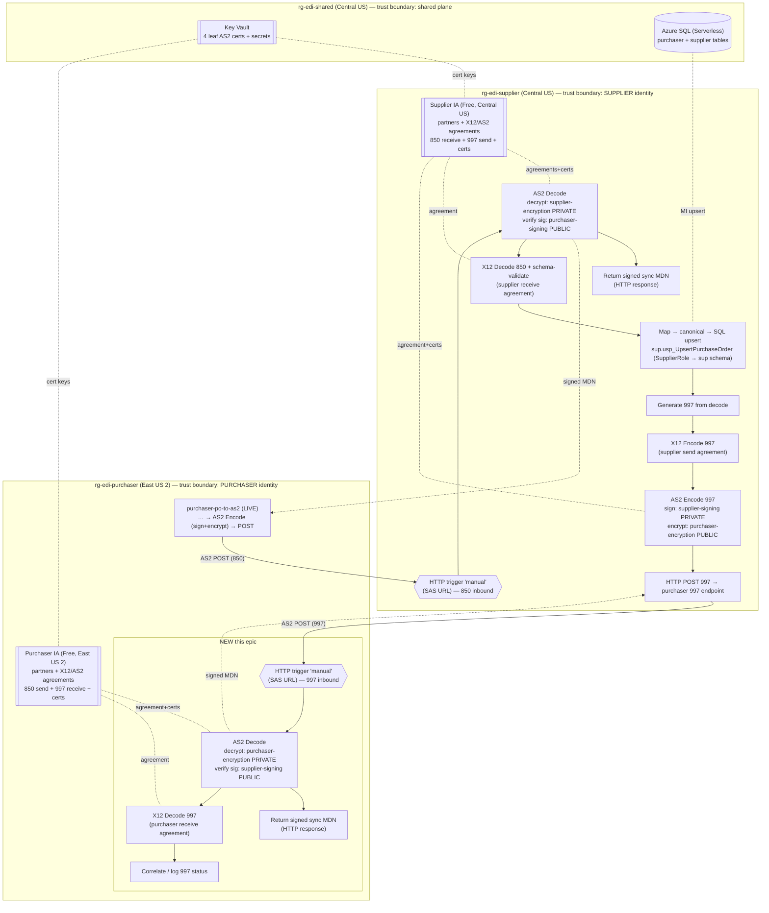
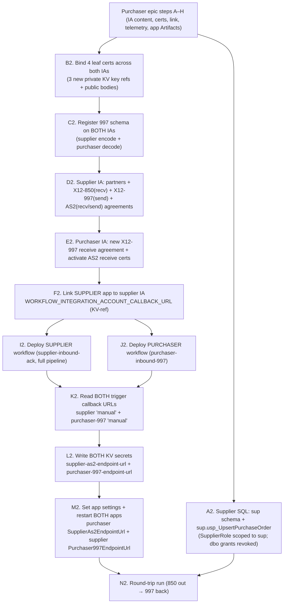

# Supplier Inbound + 997 Return Epic — Authoritative Design

> **Owner:** Mal (Lead / Integration Architect) · **Status:** Locked design (dev) · **Date:** 2026-07-21
> **Branch:** `feature/supplier-inbound-997-workflow` · **Scope:** DESIGN ONLY — no Bicep, workflow.json,
> xsd, xslt, or SQL is authored here. This document is the contract the specialists build from.
> **Do NOT merge anything from this epic** (owner directive; the coordinator handles PRs).

This artifact is the receive-side companion to `docs/purchaser-workflow-epic-design.md`. The send side
(purchaser → supplier, X12 850 over AS2) is fully designed and live through the supplier HTTP 200 stub. This
epic makes the supplier **actually process** the inbound AS2/850 message and **return a 997** functional
acknowledgment back to the purchaser over AS2 — which introduces a **brand-new purchaser receive endpoint**.
Every locked product-owner decision (§0) is treated as fixed; this document makes them concrete and buildable.

The flow diagram in §1 is the contract: **if it isn't on the diagram, it doesn't ship.**

---

## 0. Locked inputs (do not relitigate)

| # | Decision |
|---|----------|
| 1 | Supplier HTTP trigger keeps the name **`manual`** (CI extracts its callback URL — purchaser epic §6). |
| 2 | Supplier **AS2 Decode**: decrypt with **supplier-encryption PRIVATE** cert; verify signature with **purchaser-signing PUBLIC** cert; return a **signed synchronous MDN** in the HTTP response (replaces the 200 stub). |
| 3 | Supplier **X12 Decode**: decode the **850 (006030)** against a **supplier receive** agreement (host = Supplier `SUPPLIER01`, guest = Purchaser `PURCHASER01`, `ZZ` qualifiers); schema-validate against `X12_00603_850.xsd`. |
| 4 | Generate a **997** functional acknowledgment from the decode result. |
| 5 | Persist: map decoded 850 → canonical → **upsert the PO into the SUPPLIER SQL DB** via managed identity (`SupplierRole`; a **new supplier upsert proc** — the existing `usp_UpsertPurchaseOrder` is purchaser-side). |
| 6 | **997 return:** AS2-encode the 997 (sign with **supplier-signing PRIVATE**, encrypt with **purchaser-encryption PUBLIC**) and POST it to a **new purchaser receive endpoint**; the purchaser then AS2-decodes (verify supplier signature) and X12-decodes the 997. |

Inherited and unchanged: **managed identity only**, **built-in EDI/SB/SQL connectors only**, **no
`Microsoft.Web/connections`**, public network + `SecurityControl=Ignore` demo posture, per-app Free
Integration Account in each app's region (purchaser IA **East US 2**, supplier IA **Central US**), shared
plane (KV/SQL/SB) in **rg-edi-shared (Central US)**. AS2 identities use qualifier `AS2Identity`; X12 business
identities use qualifier `ZZ`.

> **EDI detail deferred to Simon.** The 997 schema, the supplier receive agreements, X12 envelopes, and the
> control-number strategy for the 997 are owned by Simon (spawned in parallel). Where this document says
> **"see Simon's EDI spec"** it is intentionally not inventing envelope/segment detail.

---

## 1. End-to-end round-trip flow (the contract)

**What is new.** Two things that did not exist before this epic:
1. The **supplier** goes from a bare `Return_200_OK` stub to a full AS2-decode → MDN → X12-decode →
   persist → 997-generate → AS2-encode → POST pipeline (single workflow; keeps trigger `manual`).
2. A **purchaser receive endpoint** (`purchaser-inbound-997`) — the purchaser has **never received** before.
   This is a distinct workflow with its own SAS-signed `manual` trigger, its own AS2 Decode, and its own MDN.

---

## 2. Trust-boundary analysis

Three boundaries, same as the send epic, but the **direction of trust reverses** for the acknowledgment leg.

| Boundary | Identity | Today (send epic) | Added by this epic |
|----------|----------|-------------------|--------------------|
| **Shared plane** (rg-edi-shared, Central US) | KV / SQL / SB | Purchaser reads certs, execs purchaser proc; supplier receives SB | Supplier now **writes** its own PO rows via `SupplierRole` (INSERT+EXECUTE already granted); both IAs read cert keys via the Logic Apps first-party SP |
| **Purchaser** (rg-edi-purchaser, East US 2) | Purchaser UAMI + purchaser IA | **Sends only**: outbound AS2 POST to supplier | **Now also receives**: new `purchaser-inbound-997` SAS endpoint decodes the 997 and returns an MDN. Purchaser IA gains **decrypt (purchaser-encryption private)** + **verify (supplier-signing public)** duties. |
| **Supplier** (rg-edi-supplier, Central US) | Supplier UAMI + supplier IA | **Stub 200 only** | **Now the full inbound processor + 997 sender**: decrypt inbound, verify purchaser sig, sign MDN, persist to SQL, sign+encrypt the 997, POST it to the purchaser. |

**Who holds which agreement.** Agreements are held by the party that **hosts** them, and each IA is
regional and per-app:

- **Supplier IA (Central US)** hosts the agreements where **Supplier is the host partner** (`SUPPLIER01`):
  it decodes the inbound 850 (receive) and encodes the outbound 997 (send).
- **Purchaser IA (East US 2)** hosts the agreements where **Purchaser is the host partner** (`PURCHASER01`):
  it already encodes the outbound 850 (send, live) and now decodes the inbound 997 (receive, new).

**Identity distinctness (non-negotiable).** The purchaser and supplier remain two separate Logic App Standard
apps with separate UAMIs, separate IAs, and separate regions. The only cross-boundary links are the **two
outbound AS2 HTTPS POSTs** to SAS-signed callback URLs:
- purchaser → supplier (850) — live.
- supplier → purchaser (997) — **new**.
Neither app shares a runtime identity with the other; each decrypts with **its own** private cert and verifies
with the **other party's** public cert. That symmetry is the whole security model.

**MDN semantics.** Each receive leg returns a **signed synchronous MDN** in the HTTP response (§0.2, §0.6).
Consistent with the send epic (locked #5), a missing/negative MDN is **non-fatal**: it is recorded as a
tracked property, not a hard failure. The supplier does not gate its 997 transmission on the MDN it returned;
the purchaser does not gate anything on the MDN it returns for the 997.

---

## 3. Integration Account wiring — exact agreements and where each lives

### 3.1 Agreement modeling — separate directional X12 agreements per transaction set

> **RECONCILED to built truth (2026-07-21).** The original design proposed one bidirectional X12 agreement per
> IA (receive=850 / send=997 in the two blocks). The coordinator locked (per Simon's proposal) and the build
> uses **two separate X12 agreement resources** — one per direction/transaction set — because a single X12
> agreement's `functionalGroupId` is a **scalar** (the 850 receive needs `GS01=PO`; the 997 send needs
> `GS01=FA`), so the two functional groups **cannot** share one agreement resource. AS2 stays as **one
> bidirectional agreement per partner pair** (its receive/send blocks carry no conflicting scalar). This
> section and §3.2 now describe what was actually built (verified against `ia-content-supplier.bicep`,
> `ia-content.bicep`, and both `workflow.json` files).

**What this means:**
- **Supplier IA** gets **two X12 agreements** — `Supplier-Purchaser-X12-850` (receive, `GS01=PO`) and
  `Supplier-Purchaser-X12-997` (send, `GS01=FA`) — plus **one** AS2 agreement `Supplier-Purchaser-AS2`.
- **Purchaser IA** keeps its live `Purchaser-Supplier-X12` (850 send) **unchanged** and gains a **new,
  separate** `Purchaser-Supplier-X12-997` (997 receive, `GS01=FA`), plus **activates** the receive block of
  the existing `Purchaser-Supplier-AS2`.
- **X12 Decode auto-resolves** its agreement from the message's ISA/GS identities, so **no
  `X12ReceiveAgreementName` app setting exists** (it was removed). Only the **Encode** actions take an explicit
  `agreementName`, read from an app setting (§6).

### 3.2 Agreements by IA (as built)

| IA (region) | Agreement resource | Protocol | Direction / role | Key envelope | Status |
|-------------|--------------------|----------|------------------|--------------|--------|
| **Supplier IA** (Central US) | `Supplier-Purchaser-X12-850` | X12 | **Receive 850** — decode inbound 850, schema-validate `X12_00603_850` (host `SUPPLIER01`, guest `PURCHASER01`); receive-side duplicate detection ON | `GS01=PO` | **NEW** |
| **Supplier IA** (Central US) | `Supplier-Purchaser-X12-997` | X12 | **Send 997** — encode outbound 997, schema `X12_00603_997`; agreement owns the 997 ISA13/GS06/ST02 | `GS01=FA` | **NEW** |
| **Supplier IA** (Central US) | `Supplier-Purchaser-AS2` | AS2 | **Receive** (decrypt supplier-encryption private, verify purchaser-signing public, return signed MDN) + **Send** (sign supplier-signing private, encrypt purchaser-encryption public, request MDN) | AS2Identity | **NEW** |
| **Purchaser IA** (East US 2) | `Purchaser-Supplier-X12` | X12 | Send 850 (LIVE, unchanged) | `GS01=PO` | unchanged |
| **Purchaser IA** (East US 2) | `Purchaser-Supplier-X12-997` | X12 | **Receive 997** — decode inbound 997, schema `X12_00603_997` (host `Purchaser`, guest `Supplier`); `needFunctionalAcknowledgement=false` (you don't ACK an ACK) | `GS01=FA` | **NEW** |
| **Purchaser IA** (East US 2) | `Purchaser-Supplier-AS2` | AS2 | **Receive** activated (decrypt purchaser-encryption private, verify supplier-signing public, return signed MDN) + Send 850 (LIVE) | AS2Identity | **ACTIVATE** receive block |

**Supplier IA partners.** The supplier IA has the same two `partners` artifacts as the purchaser IA —
`Supplier` (host, `ZZ`/`SUPPLIER01`) and `Purchaser` (guest, `ZZ`/`PURCHASER01`) — mirrored from
`ia-content.bicep` §5.2. New on the supplier IA.

**Purchaser IA additions.** The purchaser IA already has `Purchaser`/`Supplier` partners and the live 850
agreements. This epic:
- Adds a **new** `Purchaser-Supplier-X12-997` agreement (host `Purchaser`, guest `Supplier`, `GS01=FA`,
  `messageId '997'`, schema `X12_00603_997`) — **not** an added schema-reference on the live 850 agreement
  (the two functional groups can't co-exist in one agreement — §3.1).
- Binds the **receive-side certificates** into `Purchaser-Supplier-AS2`'s `receiveAgreement.securitySettings`,
  gated by a bicep `activateAs2Receive` flag that turns on only when both receive public certs are supplied
  (`ia-content.bicep`). This flips the previously-inert receive block on and names the receive certs (§4).

**997 schema placement.** The 997 xsd (`X12_00603_997`, root `X12_00603_997`) is an **IA artifact resolved by
the agreement** and is registered on **both** IAs: supplier IA (to **encode**) and purchaser IA (to
**decode**). CI registers it via the same REST `contentLink` path used for the 850 (`deploy.yml`
"Register SUPPLIER X12 850/997 schema" steps).

**997 schema placement.** Like the 850, the 997 xsd is an **IA artifact resolved by the agreement**. If it
exceeds the inline `content` limit it is registered via **REST `contentLink`** exactly like the 850 (purchaser
epic §4.3/§8-C). The 997 schema is far smaller than the 850, so it may fit inline — Kaylee confirms at build.
The 997 must be registered on **both** IAs: supplier IA (to **encode**) and purchaser IA (to **decode**).

---

## 4. Certificate binding — the RECEIVE side

Four leaf certs exist in Key Vault (`demo-as2-purchaser-signing`, `demo-as2-purchaser-encryption`,
`demo-as2-supplier-signing`, `demo-as2-supplier-encryption`) plus `demo-as2-root-ca`. The send epic bound only
two of them and **reserved** `purchaser-encryption` + `supplier-signing` "for the future receive side"
(purchaser epic §5.5). **That future is now** — this epic binds all four, in both public and private forms,
split across the two IAs.

### 4.1 Binding table (all receive/return legs)

| Function | Cert | Form | IA artifact lives in | KV mechanism |
|----------|------|------|----------------------|--------------|
| Supplier **decrypt** inbound 850 | `demo-as2-supplier-encryption` | **PRIVATE** | Supplier IA | KV **key reference** (like purchaser-signing today) |
| Supplier **verify** purchaser signature | `demo-as2-purchaser-signing` | **PUBLIC** | Supplier IA | base64 public cert (no KV ref) |
| Supplier **sign MDN** + **sign** outbound 997 | `demo-as2-supplier-signing` | **PRIVATE** | Supplier IA | KV **key reference** |
| Supplier **encrypt** outbound 997 | `demo-as2-purchaser-encryption` | **PUBLIC** | Supplier IA | base64 public cert (no KV ref) |
| Purchaser **decrypt** inbound 997 | `demo-as2-purchaser-encryption` | **PRIVATE** | Purchaser IA | KV **key reference** (reserved cert, now active) |
| Purchaser **verify** supplier signature (997 + MDN) | `demo-as2-supplier-signing` | **PUBLIC** | Purchaser IA | base64 public cert (no KV ref) |

> Note the same leaf cert appears as **private on the owning side** and **public on the counterparty side**
> (e.g. `supplier-signing` is private in the supplier IA for signing, public in the purchaser IA for
> verification). This is correct PKI — the private key never leaves its owner's IA; only the public cert is
> shared.

Each **private** IA certificate artifact needs BOTH the public cert body **and** the KV key reference (the
same shape as `purchaserSigningCert` in `ia-content.bicep` — `publicCertificate` + `key.keyVault.id`). CI
reads the public `.cer` from Key Vault at deploy time and passes it as a parameter (mirror the existing
`purchaserSigningPublicCertificate` param pattern).

### 4.2 New IA → Key Vault RBAC edges

The send epic granted the **Azure Logic Apps first-party service principal**
(`7cd684f4-8a78-49b0-91ec-6a35d38739ba`) **Key Vault Crypto User** + **Key Vault Secrets User** on the shared
vault (decision 2026-07-17; `infra/rbac/role-assignments.bicep`) — **not** an IA managed identity. That SP is
a **single well-known, tenant-wide principal shared by every Integration Account**, and the grant is scoped to
the **shared vault** that holds all the keys.

**Decision (Mal):** the three **new** private-cert key references introduced here — `supplier-encryption` and
`supplier-signing` (supplier IA) and `purchaser-encryption` (purchaser IA) — all resolve through that **same
first-party SP against the same shared vault**, so **no new RBAC edge is required**. The existing grant already
covers them. **Zoe action:** verify at build that the first-party SP grant is vault-scoped (not narrowed to a
single key) so all three new key refs resolve; if it was scoped per-secret, widen it. This is the one thing to
confirm — the intended design adds **zero** new role assignments.

---

## 5. Deploy ordering — extends the purchaser epic §8

The purchaser epic §8 established: IA content before workflows; supplier before purchaser-URL injection; SQL
before first run. This epic adds the **997 return path** and a **second callback-URL injection**, which creates
a potential ordering deadlock. Read §5.2 carefully — it is the crux of this epic.

### 5.1 New artifacts slotted into the sequence

### 5.2 The callback-URL deadlock — and how it is broken

There is a **circular dependency** if you naïvely reuse the send-epic ordering:
- The **purchaser send** workflow needs the **supplier** callback URL → "deploy supplier first."
- The **supplier 997-send** step needs the **purchaser-997** callback URL → "deploy purchaser first."

Naïvely, supplier-before-purchaser **and** purchaser-before-supplier = **deadlock**.

**Resolution (Mal — locked).** A trigger's `listCallbackUrl` depends only on the **trigger/workflow existing**,
**not** on any downstream app setting being populated. So **decouple "deploy the workflow" from "inject the app
setting."** Ordering becomes:

1. Deploy **both** workflows first (supplier `supplier-inbound-ack` **and** purchaser `purchaser-inbound-997`).
   Neither needs the other's URL to *deploy* — the POST target app settings are only read at *run* time.
2. **Then** read **both** callback URLs (they now both exist).
3. **Then** write **both** KV secrets (`supplier-as2-endpoint-url`, `purchaser-997-endpoint-url`).
4. **Then** set **both** app settings and **restart both apps**.

No step 1 workflow deploy depends on a step 3/4 secret, so the cycle is cut. `deploy.yml` already does the
supplier half of this after workflow deploy (`listCallbackUrl` → KV secret → restart, purchaser epic §6); this
epic **adds the symmetric purchaser-997 half in the same post-deploy phase** so both injections happen after
both workflows are live. **Do not** interleave "deploy supplier → inject → deploy purchaser → inject" — batch
the two deploys, then batch the two injections.

> **Assumption flagged:** the purchaser `purchaser-inbound-997` workflow must be packaged/deployed with the
> purchaser app zip in the same deploy that ships `purchaser-po-to-as2`. If the two purchaser workflows ship in
> separate deploys, the callback-URL read for the 997 endpoint must move to whichever deploy lands the 997
> workflow. Recommend: ship both purchaser workflows together.

**Destroy ordering:** supplier IA content (agreements → partners → schema → cert artifacts) and the new KV
secret `purchaser-997-endpoint-url` tear down before the supplier Free IA / compute bundle, symmetric with the
purchaser teardown in the send epic §8.

---

## 6. App settings additions per app

Mirror the existing `SupplierAs2EndpointUrl` / `X12AgreementName` conventions (clean names, no `__url`
indirection for the outbound POST target — the runbook confirms the live purchaser setting is
`SupplierAs2EndpointUrl`, not `SupplierAs2Endpoint__url`).

### 6.1 Supplier app (`logicapps/supplier`) — new

| Setting | Value | Purpose |
|---------|-------|---------|
| `WORKFLOW_INTEGRATION_ACCOUNT_CALLBACK_URL` | `@Microsoft.KeyVault(...)` (supplier IA callback URL secret) | Links the supplier app to the **supplier IA** so AS2/X12 Decode + Encode resolve agreements. New — the stub needed no IA link. |
| `Purchaser997EndpointUrl` | `@Microsoft.KeyVault(SecretUri=…/purchaser-997-endpoint-url)` | Outbound AS2 POST target for the 997 (the purchaser-inbound-997 callback URL). Injected post-deploy (§5.2). |
| `X12SendAgreementName` | `Supplier-Purchaser-X12-997` | 997 X12 Encode `agreementName`, read via `@appsetting('X12SendAgreementName')`. Names the supplier **997 send** agreement (`GS01=FA`). *(This is a distinct setting from the purchaser's `X12AgreementName`, which names the 850 send agreement — see §3.1 reconciliation.)* |
| `sql__serverFqdn` / `sql__databaseName` / `sql__clientId` | concrete values | Already present in supplier `connections.json`; confirm they resolve (supplier persist uses the same shared SQL server, `SupplierRole` scoped to `sup`). |

AS2 identities (`as2From: 'SUPPLIER01'`, `as2To: 'PURCHASER01'`) are **workflow constants** (as the purchaser
workflow hard-codes its `as2From`/`as2To`), not app settings — Wash sets them in `workflow.json`.

### 6.2 Purchaser app (`logicapps/purchaser`) — additions

| Setting | Value | Purpose |
|---------|-------|---------|
| `WORKFLOW_INTEGRATION_ACCOUNT_CALLBACK_URL` | (existing) | Already links to the purchaser IA; the inbound-997 AS2/X12 Decode reuse it. **No new setting.** |
| *(none required for decode)* | — | AS2/X12 Decode resolve the agreement + receive certs from the message identities against the linked IA. No new POST target on the purchaser (the 997 endpoint is a *trigger*, not an outbound call). |

> The purchaser needs **no** new outbound app setting — it only *receives* the 997. The only new purchaser-side
> config is the AS2 **receive** cert binding, which is an **IA** concern (§4), not an app setting.

---

## 7. Supplier SQL persist (locked #5)

The decoded 850 is mapped to the canonical PO shape and upserted into the supplier's **own `sup` schema** via a
dedicated stored procedure, distinct from the purchaser's `dbo.usp_UpsertPurchaseOrder`.

> **RECONCILED to built truth (2026-07-21).** The §7 open question below was **resolved in favor of
> supplier-owned tables** — my recommendation. The build creates a **`sup` schema** with mirror tables
> (`infra/sql/schema/030-sup-tables.sql`) and **`sup.usp_UpsertPurchaseOrder`**
> (`040-usp-upsert-supplier.sql`), and a code-review finding **tightened `SupplierRole`**: its earlier
> `dbo` INSERT+EXECUTE grants are **explicitly REVOKED** and it is granted INSERT+EXECUTE on **`SCHEMA::sup`
> only** (`infra/sql/create-users-roles.sql`). The workflow calls `[sup].[usp_UpsertPurchaseOrder]`.

- **Proc (built):** `sup.usp_UpsertPurchaseOrder` — same OPENJSON-shredded `@LinesJson NVARCHAR(MAX)` contract
  as the purchaser proc (the built-in SQL connector cannot pass a TVP — locked repo decision), idempotent on
  `PoNumber` so an AS2 re-transmit does not duplicate.
- **Grant (built):** `SupplierRole` is scoped to `SCHEMA::sup` (INSERT+EXECUTE); its prior `dbo` grants are
  revoked so a redeploy against an already-granted database actually removes them. This is a **tightening**
  from the design's "no new grant on dbo" — a strictly better trust boundary. **Zoe signed off.**
- **Connection:** supplier `connections.json` already defines the managed-identity `sql` service-provider
  connection; the workflow's `Persist_Purchase_Order` targets `[sup].[usp_UpsertPurchaseOrder]`; no
  `Microsoft.Web/connections`.

> **Resolved (was open question):** supplier persists to **supplier-owned `sup` tables**, not the shared `dbo`
> `PurchaseOrder` tables — keeping the two parties' data boundaries clean, consistent with the distinct-identity
> principle in §2.

---

## 8. Workflow shape (flow only — Wash owns connector shapes)

Mal designs the **flow and wiring**; Wash authors the exact `workflow.json` action shapes and confirms
built-in AS2/X12 Decode operation types against the live runtime (as was done for the Encode actions).

### 8.1 Supplier `supplier-inbound-ack` (rewrite the stub)

1. **`manual`** HTTP Request trigger (unchanged name; CI depends on it).
2. **AS2 Decode** — decrypt + signature-verify against the supplier IA AS2 receive agreement; emits decoded
   payload + a **signed MDN**.
3. **Response** — return the signed **synchronous MDN** in the HTTP response (this *replaces* `Return_200_OK`).
   Everything after the Response runs **asynchronously** (the purchaser's send already treats the MDN as
   non-fatal, so returning it and continuing is safe).
4. **X12 Decode (850)** + schema-validate; agreement auto-resolved from ISA/GS identities (no
   `X12ReceiveAgreementName` setting). After decode, the flow **forks** into two parallel branches (5 and 6–9).
5. **Persist branch** — `Transform_850_to_PO_Canonical` (map) → `Parse_Canonical` (`json(xml)`) →
   `Normalize_Lines` (force `lines` to always be a JSON array so `OPENJSON` works for 1-line and N-line POs) →
   `Persist_Purchase_Order` = `EXEC [sup].[usp_UpsertPurchaseOrder]` (MI, `SupplierRole` scoped to `sup`).
6. **Generate 997** — the workflow **explicitly builds** the 997 XML (`Build_997_Xml`, root `X12_00603_997`,
   006030, structure `ST-AK1-AK2-AK5-AK9-SE`) rather than relying on the X12 Decode auto-generator (which
   emits a **4010** 997). AK102/AK103/AK202 echo the decoded 850's GS06/GS08/ST02. *(Resolved — was flagged to
   Simon; see Simon's EDI spec for the echo rules.)*
7. **X12 Encode (997)** — `agreementName = @appsetting('X12SendAgreementName')` (= `Supplier-Purchaser-X12-997`,
   `GS01=FA`); the agreement owns the 997's own ISA13/GS06/ST02.
8. **AS2 Encode (997)** — `as2From: 'SUPPLIER01'`, `as2To: 'PURCHASER01'`; sign (supplier-signing private) +
   encrypt (purchaser-encryption public), request sync MDN.
9. **HTTP POST** the 997 AS2 bytes + headers to `@appsetting('Purchaser997EndpointUrl')`, with a
   `Record_997_Send_Failure` handler on `[FAILED, TIMEDOUT]` for run-history visibility.

> **Design note / open question:** returning the MDN (step 3) before the heavy processing (4–9) is the correct
> AS2 pattern, but a **stateful** workflow that continues after `Response` means the 997 transmission failing
> does **not** un-send the MDN. That is acceptable (MDN = "I received & could decrypt/verify it"; 997 = "here's
> what my app made of it"). If the business wants the 997 failure to be visible, capture it as a tracked
> property + surface via telemetry (v2 already enabled). **No dead-letter here** — this is HTTP-triggered, not
> Service Bus, so there is no lock to settle. Flagged for Jayne's test matrix.

### 8.2 Purchaser `purchaser-inbound-997` (new)

1. **`manual`** HTTP Request trigger (SAS URL; new endpoint).
2. **AS2 Decode** — decrypt (purchaser-encryption private) + verify (supplier-signing public) against the
   purchaser IA AS2 receive agreement; emit decoded 997 + signed MDN.
3. **Response** — return the signed synchronous MDN.
4. **X12 Decode (997)** against the new `Purchaser-Supplier-X12-997` receive agreement (schema `X12_00603_997`;
   `needFunctionalAcknowledgement=false` — you don't ACK an ACK).
5. **Correlate / log** — record the acknowledged interchange/group control numbers as tracked properties
   (close the loop against the 850 the purchaser sent). Deep correlation store is **out of scope** for the
   demo — flag if the owner wants persisted ACK reconciliation.

---

## 9. Risk assessment — does the 997 return materially increase risk?

**Yes, moderately — and the mitigations are ordering + reuse, not new infrastructure.**

| Risk | Severity | Mitigation |
|------|----------|------------|
| **Callback-URL deadlock** between the two injections | High if unmanaged | Broken by §5.2 (deploy both workflows, then inject both). This is the single most important ordering rule in the epic. |
| **Cert sprawl** — all 4 leaf certs now bound in both forms across two IAs | Medium | §4 table is exhaustive; the reserved certs from send epic §5.5 are exactly the ones activated. No new certs generated. |
| **Second SAS endpoint** (purchaser now receives) widens attack surface | Medium | Same posture as the supplier endpoint (SAS-signed, demo `SecurityControl=Ignore`). Acceptable for the demo; note for any hardening pass. |
| **Async 997 after MDN** — 997 send failure is invisible without telemetry | Low/Medium | v2 telemetry + tracked properties (§8.1 note); Jayne adds a negative test. |
| **Supplier SQL data boundary** (shared vs supplier-owned tables) | Low | §7 open question; recommend supplier-owned tables. |
| **No new RBAC edge assumption** could be wrong if the first-party SP grant was per-secret scoped | Low | Zoe verifies vault-scope at build (§4.2). |

**Recommendation:** proceed. The round-trip is buildable with the existing security model and **zero** new
identities or role assignments, provided §5.2 ordering is honored and §4.2 is verified.

---

## 10. Work split — build wave (for coordinator fan-out)

> **Historical fan-out (pre-build).** This section is the task list as originally handed to the crew. The build
> refined several items — the **authoritative built truth is in §§3, 6, 7, 8, 11** (directional X12 agreements,
> `X12SendAgreementName`, supplier-owned `sup` schema + `sup.usp_UpsertPurchaseOrder`, explicit 997 build).
> Retained for provenance; where this section and the reconciled sections differ, the reconciled sections win.

> **Reviewer gate:** Mal reviews every artifact before any merge. **Nothing merges** (owner directive) — the
> coordinator handles PRs. On rejection, a **different** agent revises (not the original author).

**Simon — EDI spec detail (owns the EDI substance this doc defers to)**
- Define the **997 schema** (`X12_00603_997` or the correct id/version) and register-placement (inline vs
  `contentLink`) on **both** IAs.
- Specify the **supplier receive** agreement (X12 850 decode: validation, schema ref, envelope) and the
  **supplier send** agreement (X12 997 encode: control-number strategy for the 997 interchange/group/set).
- Specify how the **997 is generated** from the X12 Decode (built-in functional-ack emission vs mapped encode).
- Specify the supplier SQL tables + `sup.usp_UpsertPurchaseOrder` (supplier-owned `sup` schema; OPENJSON, no
  TVP; idempotent on `PoNumber`), and resolve the §7 shared-vs-supplier-owned tables question.
- Define the decoded-850 → canonical map used by the supplier persist.

**Kaylee — Bicep + app settings + CI + IA content**
- Author **supplier IA content** (partners + X12 + AS2 agreements) mirroring `ia-content.bicep`; **extend
  purchaser IA content** (997 schema ref on X12 receive; activate AS2 receive cert binding).
- Bind the **3 new private cert KV key refs** + public cert bodies across both IAs (§4); pass public `.cer`
  bodies as CI params like the existing pattern.
- Register the **997 schema** on both IAs (inline or REST `contentLink` per size).
- App settings: supplier `WORKFLOW_INTEGRATION_ACCOUNT_CALLBACK_URL` (KV-ref), `Purchaser997EndpointUrl`
  (KV-ref), `X12AgreementName`; add supplier SQL DDL/proc step.
- **Extend `deploy.yml`** for the §5.2 batched ordering: deploy both workflows, then read **both** callback
  URLs, write **both** KV secrets, set **both** app settings, restart **both** apps. Add the KV secret
  `purchaser-997-endpoint-url` output.

**Wash — workflows**
- Rewrite supplier `supplier-inbound-ack` (keep `manual` trigger) to the §8.1 pipeline; confirm built-in **AS2
  Decode / X12 Decode** operation types + output shapes against the live runtime (as done for Encode).
- Author purchaser `purchaser-inbound-997` (§8.2). Wire `@appsetting` references; confirm
  `connections.json`/`parameters.json` need no `managedApiConnections`.

**Zoe — security**
- **Verify** the first-party SP grant is vault-scoped so the 3 new private key refs resolve (§4.2) — expected
  **no new role assignment**. If per-secret scoped, widen it.
- Confirm `SupplierRole` (INSERT+EXECUTE) covers the new supplier proc — expected **no new SQL grant**.

**Jayne — QA / samples / tests**
- Round-trip test: 850 out → supplier decode/persist/997 → purchaser 997 decode. Assert supplier run reaches
  `POST 997` = 200 and purchaser `purchaser-inbound-997` runs `X12 Decode (997) = Succeeded`.
- Negative tests: bad signature (verify fails → MDN negative, non-fatal), bad decrypt, 997-POST failure
  visibility (tracked property), supplier persist idempotency on `PoNumber`.

**Book — docs**
- New receive-side runbook; update `docs/end-to-end-flow.md` to the full round-trip; update
  `docs/trading-partner-onboarding.md` with the supplier agreements + the purchaser receive endpoint.

---

## 11. Open items / assumptions — resolution status (updated 2026-07-21, post-build)

All design-time open items are now **resolved by the build** except the runtime-verification items Zoe/Jayne
own at deploy time. Status recorded here for the reviewer gate.

1. **997 encode agreement modeling** — **RESOLVED.** Built as **two separate directional X12 agreements**
   (`Supplier-Purchaser-X12-850` receive `GS01=PO`, `Supplier-Purchaser-X12-997` send `GS01=FA`; likewise a
   dedicated `Purchaser-Supplier-X12-997` on the purchaser IA) because one agreement's `functionalGroupId` is
   scalar. See §3.1. Original single-bidirectional-agreement proposal superseded.
2. **997 generation mechanism** — **RESOLVED.** Explicit `Build_997_Xml` (006030, `X12_00603_997`) + X12
   Encode, **not** the Decode auto-generator (which emits 4010). §8.1 step 6.
3. **Supplier persist target** — **RESOLVED** in favor of **supplier-owned `sup` schema** +
   `sup.usp_UpsertPurchaseOrder`; `SupplierRole` tightened to `SCHEMA::sup` (dbo grants revoked). §7.
4. **First-party SP grant scope** — **VERIFIED (Zoe SIGN-OFF).** The 3 new private key refs resolve through
   the existing vault-scoped first-party-SP grant; **no new RBAC edge**. §4.2. (Runtime cert-binding behavior
   is a Zoe runtime-verify note, not a blocker.)
5. **Two purchaser workflows in one deploy** — **RESOLVED.** `purchaser-inbound-997` ships in the purchaser
   app zip; CI reads its callback URL in the same non-interleaved dual-injection step as the supplier URL. §5.2.
6. **AS2 Decode / X12 Decode built-in shapes** — **runtime-verify (Wash + Jayne).** Shapes mirror the verified
   Encode actions and Learn B2B examples; the `goodMessages[].body` per-item accessor and the AS2 decode
   output paths are flagged in the workflow descriptions for a designer/runtime round-trip. Non-blocking for
   the doc; Jayne's health-checks cover it. §8.
7. **Async 997 failure visibility** — **accepted for demo.** HTTP-triggered receive has no SB lock to settle; a
   997-send failure after the MDN is captured by `Record_997_Send_Failure` + tracked properties + v2 telemetry.
   §8.1, §9.

---
*Authored by Mal; reconciled to built truth 2026-07-21. The round-trip diagram in §1 is the contract: if it
isn't on the diagram, it doesn't ship. §§3, 6, 7, 8, 11 carry post-build reconciliation banners where the
build refined the design (directional agreements, `sup` schema, explicit 997 build). EDI substance is Simon's.
Mal reviews before merge; nothing merges (owner directive).*
